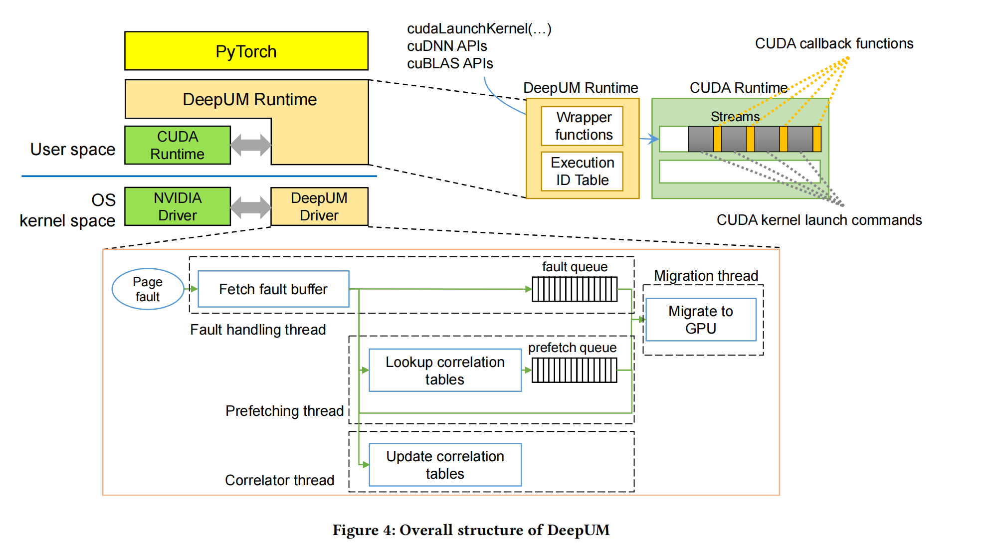

# [ASPLOS'23]  DeepUM

------

**Title:** DeepUM: Tensor Migration and Prefetching in Unified Memory

**Keywords:** deep learning, neural networks, CUDA, unified memory, data prefetching, runtime system, device driver

**Major Contribution:**

* DeepUM利用CUDA UM允许GPU内存超额订阅。它使用相关预取来自动预取数据。它是全自动的，对用户都是透明的。
* 提出了一种专门预取DNN中页面的相关预取技术。使用两个相关表记录了DNN训练阶段的内核执行历史和页面访问模式。
* 提出了一种专门预取DNN中预取页面的相关预取技术。这两个相关表记录了DNN训练阶段的内核执行历史和页面访问模式。
* DeepUM可以以更大的批处理大小运行模型，而以前的方法无法运行。

> 个人评价：利用相关性用两种相关表对GPU执行内核和预取UM块进行“链式反应”式预取

------

## 本文简介

由于深度神经网络（DNN）随着范围和深度的增大其性能会更好。因此现在的DNN的范围和深度再不断扩大，从而需要巨大的 GPU 内存和计算能力。本文提出了一个名为 DeepUM 的框架，该框架利用 CUDA 统一内存（UM）来实现 DNN 的 GPU 内存超量订阅。虽然 UM 允许使用Page Fault机制进行内存超量订购，但页面迁移会带来巨大的开销。基于DNN训练负载会出现大量重复固定的内核执行模式核内存访问模式，DeepUM 使用一种新的相关预取技术来隐藏页面迁移开销。DeepUM是全自动的，对用户透明。本文还提出了两种优化技术，以最大限度地减少 GPU 故障处理时间。本文使用来自 MLPerf、PyTorch 示例和 Hugging Face 的九个大规模 DNN 评估了 DeepUM 的性能，并将其与六种最先进的 GPU 内存交换方法进行了比较。评估结果表明，DeepUM 对 GPU 内存超量订阅非常有效，可以处理其他方法无法处理的大型模型。

------

## 背景知识和相关概念

DNN需要的参数量非常庞大，因此通常需要大量的GPU进行训练。对于普通用户来说，可以对已经经过训练的DNN模型在小系统上进行微调。但是在现在，以GPT-3为例，参数量就有1750亿，这就使得即使预先训练完在小系统上微调也是很困难的。即使是NVIDIA H100 80GB GPU无法容纳1750亿参数超过300GB的存储空间占用。为了解决这个问题，有一系列的研究工作被提出，大方向主要有数据压缩、混合精度训练、data recomputation和内存交换技术。DeepUM这篇文章主要是关注内存交换。

> 关于混合精度训练的详细介绍，可以参考这篇文章 [混合精度训练 mixed precision training - 知乎 (zhihu.com)](https://zhuanlan.zhihu.com/p/490464586)、

------

### CUDA Unified Memory

在今天典型的PC上，CPU与GPU的内存是物理上独立的，通过PCI-E总线进行连接通信。实际上，在CUDA 6.0之前，程序员必须在编程期间很清楚这一点，并且反应在代码中。必须在CPU和GPU两端都进行内存分配，并不断地进行手动copy，来保证两端的内存一致。

Unified memory在程序员的视角中，维护了一个统一的内存池，在CPU与GPU中共享。使用了单一指针进行托管内存，由系统来自动地进行内存迁移。

CUDA UM其主要优势在

* 简化了代码编写和内存模型
  * 可以在CPU端和GPU端共用一个指针，不用单独各自分配空间。方便管理，减少了代码量。
  * 语言结合更紧密，减少与兼容语言的语法差异。
  * 更方便的代码迁移。

当然Unified Memory的说法在不同论文中可能不同，例如OpenCL中将其称之为Shared Virtual Memory。

------

GPU内存交换技术主要分成两种。一种是基于CUDA UM的页面预取，另一种是non-UM GPU内存的换入换出。

但事实上，很少有工作会去关注UM，其实与Shared Virtual Memory这个说法类似，它有点像传统意义的Virtual Memory。因此在地址翻译和page fault处理的开销是比较大的。每个GPU请求都需要进行一次地址翻译，这个开销可想而知。除此之外，page fault处理时会引起CPU-GPU协同进行I/O来进行数据迁移。

相比于Non-UM,UM还是在一些场景有巨大作用的：

* GPU内核的内存需求大于实际GPU内存容量，从而能够有效应对大规模DNN的内存需求
* UM作为一种Virtual Memory，相比于Non-UM能够更好地解决内存碎片问题，更有可能服务于大规模DNN

------

### GPGPU

GPGPU通用图形处理器技术，一个从GPU衍生出的概念。

GPGPU并不比GPU更厉害，只是去掉GPU的图形显示部分，将其余部分全部投入通用计算，并成为AI加速卡（一种并行计算硬件）的核心，允许程序员在比CPU更短的时间内处理大量的计算。

------

## GPU内存层次结构和CUDA编程模型

有许多高效管理GPU并将计算任务卸载到GPU的编程模型被提出，如CUDA , OpenACC , OpenCL等。其中CUDA是由NVIDIA开发的GPU并行编程模型，是本文主要关注的Model。

程序员必须定义一个类似函数的CUDA内核来将计算卸载到GPU。然后，在GPU上执行CUDA内核，由𝑁个不同的CUDA线程并行执行𝑁次。每个CUDA线程都有一个唯一的线程ID，用于决定控制流和计算要访问的内存地址。

CUDA线程分组为一个线程块，线程块分组为一个网格grid。程序员在网格grid启动CUDA内核时指定了网格的配置。

图1显示了NVIDIA GPU的最新微体系结构的内存层次结构。一个GPU由几十个流式多处理器（SMs）组成。网格中的每个线程块都被映射到GPU中的一个SM。一个SM包含几百个CUDA核。一个线程块中的一个线程被映射到一个CUDA核心，而一个SM可以同时处理多个线程块。

每个SM都有不同类型的内存单元，如寄存器、L1缓存、共享内存（scratchpad memory）和constant memory（read-only memory）。寄存器对每个线程都是私有的，其他内存单元在SM中共享。在SM之外，有一个跨所有SM共享的L2缓存。全局内存是一个芯片外的DRAM，通常只有几GB到几十GB。与传统存储体系结构一样，更靠近CUDA核心（SMs）的内存单元具有较低的延迟和较小的容量。尽管GPU提供了数十GB的全局内存，但DNN的工作负载严重缺乏足够的全局内存。

由于**GPU线程不能直接访问主存**，除非程序员将主存空间映射到GPU内存空间，因此程序员必须手动在GPU全局内存和CPU主存之间移动数据。此外，访问映射到GPU内存空间的主内存会影响性能，因为它在每次内存访问上导致PCIe传输。为此，NVIDIA提出了统一内存（UM）。

### **重识CUDA Unified Memory**

它提供了一个单一的内存地址空间，可以被同一系统中的CPU和GPU同时访问。

当GPU访问的页面不在GPU内存中时，GPU会发出页面故障中断信号，NVIDIA设备驱动程序会将故障页面从系统的任何地方迁移到GPU。从而使得GPU拥有虚拟内存机制，进而允许UM使GPU内存超额订阅，而无需程序员的任何干预。

尽管UM很强大，但它的缺点是GPU页面故障处理代价高昂。GPU中的每个流多处理器（SM）都存在一个TLB。当GPU中出现page fault时，相应SM的TLB将被锁定，在SM的所有故障都得到解决之前，无法处理任何新的转换。

此外，page fault需要在CPU和GPU之间进行昂贵的迁移页面和页面驱逐的I/O操作。因此，强烈建议插入CUDA预取API函数（例如，（cudaMemPrefetchAsync())或CUDA USER-HINT API函数（例如，（cudaMemPrefetchAsync()）），以减少PAGE FAULT。

### NVIDIA Page Fault Handler

当NVIDIA GPU引发page fault中断信号时，NVIDIA驱动程序捕获中断信号并处理它。故障缓冲区是NVIDIA GPU中的一个循环队列。它存储错误的访问信息。GPU可以同时产生多个故障，在故障缓冲区中同一页面可以有多个故障条目。UM块是一组最多512个连续的页面和NVIDIA驱动程序的管理单元。在同一UM块中的所有页面都由NVIDIA驱动程序一起处理。

> UM块的最大大小是4KB×512=2MB

每个UM块对象都包含UM块中所有页面的信息，例如哪个处理器具有这些页面，以及这些页面是否被映射为具有读保护或写保护。如果UM块包含故障页面，我们将UM块成为故障UM块。

图3显示了page fault处理的示意图。首先，NVIDIA驱动程序从GPU（1）中的故障缓冲区获取有故障访问的页面地址和访问类型。然后，NVIDIA驱动程序预处理故障（2）。它会删除重复的地址，并根据它们的UM块对它们进行分组。接下来，NVIDIA驱动程序检查每个故障UM块的可用GPU内存空间(3)。如果没有GPU内存空间可用于出现故障的UM块，它会将一些页面从GPU驱逐到CPU(4)。然后，它在GPU中填充故障页面（即，它将GPU内存空间分配给出现故障的页面）(5)，它会将页面转移到GPU上(6)。当传输完成时，UM块的故障页面将被映射到GPU（7）。重复此过程，直到处理所有出现故障的UM块（8）。最后，NVIDIA驱动程序向GPU发送一个回放信号，故障处理程序完成（9）。

------

## DeepUM Overview

图4显示了DeepUM的整体结构。它由DeepUM运行时和DeepUM驱动程序组成。该驱动程序是一个Linux内核模块。DeepUM的目标是最流行的深度学习框架之一，并且PyTorch运行在DeepUM运行时之上。

DeepUM运行时 (DeepUM Runtime)。DeepUM运行时为CUDA内存分配API函数提供了wrapper函数，**以将所有GPU内存分配请求切换到UM空间分配请求**。通过在UM空间中分配所有的GPU内存对象，它可以轻松地完成GPU内存的超额订阅。此外，DeepUM运行时还为CUDA内核启动命令和其他CUDA库函数提供了wrapper函数，例如cuDNN和cuBLAS中的函数。请注意，CUDA库函数也可以启动CUDA内核。

DeepUM运行时管理一个称为执行ID表(Exectution ID Table)的表。该表包含内核启动历史记录，并包含每个内核的名称和参数的哈希值。当一个新的内核启动命令进入DeepUM运行时时，它将计算内核名称和参数的哈希值。然后，它**查找执行ID表，以查找具有相同哈希值的命令。如果它找到了一个匹配的命令，那么它就会给内核提供相同的执行ID。否则，它将为内核分配一个新的执行ID，并将该信息保存在表中**。最后，DeepUM运行时在排队使用内核启动命令之前，将一个CUDA回调函数排队到CUDA运行时。回调函数通过Linux ioctl命令将以下内核启动命令的执行ID传递给DeepUM驱动程序。DeepUM驱动程序使用传递的执行ID进行相关预取。

DeepUM驱动程序。DeepUM驱动程序处理GPU页面故障，并预取页面到GPU。我们观察到，在DNN的训练阶段，内核内的内存访问模式是固定和重复的。因此，记忆重复的模式和利用这些信息进行预取是可取的。由DeepUM驱动程序管理的相关表记录了DNN训练阶段内核执行的历史及其页面访问。DeepUM驱动程序通过预测下一步将执行哪个内核来根据相关表中的信息预获取页面。这篇文章会在第4.2节中描述DeepUM驱动程序所使用的相关预取机制。

在DeepUM驱动程序中有四个内核线程：故障处理线程、相关器线程、预取线程和迁移线程。故障处理线程使用在NVIDIA驱动程序中实现的功能来处理GPU页面故障，例如访问故障缓冲区和向GPU发送回放信号。NVIDIA GPU有一个硬件故障缓冲区，它可以积累有故障访问的信息。DeepUM 驱动程序会拦截向英伟达驱动程序发送的页面故障中断信号，故障处理线程会读取故障缓冲区。故障处理线程将故障访问信息传递给其他三个线程。

故障队列*fault queue*是一个单生产者/单消费者的队列，它存储了出现故障的页面的UM块地址。它持有驱动程序中要处理的最高优先级项，以使GPU尽快重放故障访问。

相关器线程*correlator thread*管理关联表。它根据故障处理线程中的故障信息来更新相关表。在后续再详细讨论相关性表的结构，以及相关器线程如何更新它们。

预取线程*prefetching thread*查找相关表，并计算用故障块地址预取的UM块地址。然后，它将预取命令排队到预取队列，即单生产者/单消费者队列。预取命令由要预取的UM块地址和预测要使用相应UM块的执行ID组成

最后，迁移线程在CPU和GPU之间迁移UM块。故障队列的优先级高于预取队列。它首先处理由故障处理线程管理的故障队列中的命令。当故障队列为空时，它处理来自由预取线程管理的预取队列的命令。

------

## **GPU页面的关联预取**

### **Pair-based correlation prefetching**

Pair-based相关预取在相关表中记录过去的丢失地址序列.。当cache line miss时，它查找相关表并预取与未命中地址相关的所有地址。图5显示了cache line的pair-based相关预取的示例。

> Correlation table中的每一**行**都是N路组相联，以减少映射到同一行的UM块之间的地址冲突。本例为便于说明，假设了1路组相联。

对于每一个Set都有NumLevels个后继Miss addresses层级。对于每一个层级，都有NumSuccs个以MRU(最近最常使用)顺序从左到右排列的表项。Last和SecondLast是两个指针，分别指向当前和上一次miss的地址。

图（a）为例，a表项中第一层级包含b，这是因为b miss发生在a miss之后。而在第二层包含c,因为c miss在b miss之后。如图（b）所示，当a再次miss时，Last指针指向a表项，SecondLast指针指向c表项。同时，b表项和c表项同步更新。a miss在c miss之后，因此b表项的第二层包含a。同理，c表项的第一层包含a。

此时由于重新访问a，并且a表项有后继表项记录（b和c），因此b,c将被预取。

###  **DeepUM中的相关预取**

DeepUM中的相关性预取旨在通过预取CUDA内核预期要访问的页面来减少page fault。与原始的相关预取不同，DeepUM使用了两种类型的相关表：*Execution ID correlation table*和*UM block*。这两种类型的表都有一个级别（𝑁𝑢𝑚𝐿𝑒𝑣𝑒𝑙𝑠= 1），因为预取线程确实有链接。此外，由于DNN工作负载的特性，没有理由维护多个级别。请注意，DeepUM的相关性预取在UM块级别工作，而不是在高速缓存行或页面级别工作。

#### Execution ID correlation table

执行ID相关表（简称为执行表）记录了CUDA内核的执行ID的执行历史记录，并且只有一个表存在。执行id来自于DeepUM运行时。

执行表中的每个条目都包含相关的执行id集。每个集合由四个执行id组成。前三个id表示在最后一个内核之前执行的内核（更新表时当前执行内核）。因此，最后一个ID表示在发生预取时要执行的下一个内核。例如，执行ID 0的条目的记录为（7、9、92、75)。执行ID 0的条目中的此记录意味着执行ID为7、9和92的内核已被执行，而执行ID为0的内核当前正在执行。它预测接下来要执行的内核的执行ID为75。

每个条目所包含的记录的数量是可变的，也就是说，一个内核的后继内核的数量是可变的。因此，每个条目都可以保存后继内核的执行id的所有历史记录。DeepUM选择这个方案来尽可能准确地预测下一个要执行的内核。尽管预测下一个要访问的UM块的不正确结果并不是那么昂贵，但预测下一个要执行的内核的不准确结果也是昂贵的。

#### **UM block correlation table**

NVIDIA驱动程序通过将页面分组为多个UM块来管理CUDA UM空间中的页面。最多有512个相邻的页面被分组到一个UM块中。UM块相关表（简称块表）在UM块级别记录历史记录，而不是记录故障页面地址的历史记录。选择这种粒度有两个原因。一是对于大规模的dnn，有太多的页面地址需要管理。另一个原因是，DeepUM 的页面管理粒度与英伟达驱动程序相同，因此效率更高。请注意，NVIDIA驱动程序以UM块的粒度来管理页面。

每个执行ID都有一个块表，并在相应的CUDA内核中记录UM块访问的历史记录。它类似于在原始相关性预取中使用的表。但是，块表包含指向预取的最后一个UM块的结束UM块（the last UM block prefetched）的地址，以及在相应的内核执行中指向第一个出现故障的UM块的开始UM块。这两个指针用于实现链接。开始UM块和结束UM块都在当前执行的内核的转换期间被捕获。End UM块是页面所在的UM块，在执行ID转换之前最后出现故障。启动UM块是在执行ID转换后发生的第一个故障页面所在的UM块。

考虑图7中的块表，假设DeepUM正在为执行ID为0的内核预取UM块b。还假设执行ID为1的内核将在执行ID为0的内核之后立即执行。b的后继UM块是e和q。由于块q与执行ID为0的结束UM块相同，因此预取线程停止对执行ID为0的内核的预取。然后开始预取块k（用于执行ID1的块表的开始UM块）

这个过程被称为链接（chaining）。它是在页面故障发生后不断计算UM块地址的过程。当一个新的页面故障中断信号出现，或者预取线程无法预测下一个要执行的内核时，链接将结束。当预取线程进入下一个𝑁内核的所有预取命令时，链接会暂停。预取线程在当前执行的内核完成后重新开始

> 整个预取过程就像链式反应一样，当前执行内核会一直预取直到遇到end指针指向的UM块，中间的后继链式查找过程可以通过块的后继链在一起；除了链式反应进行到end指针指向的UM块这种情况，还有可能出现后继块根本指不到end指针指向的UM块。简单举例，假设a的后继是b,c而b的后继是c,a，c的后继是a,b，end指针指向的是e。那么在这种情况下，a,b,c都取完，链式反应就进行不下去了。这两种情况都会使得当前执行内核预取任务终止进而转而执行下一执行内核进行执行。

### 页面驱逐和预驱逐

当驱动程序无法为迁移出现故障的页面分配GPU内存空间时，就会发生页面驱逐。图8显示了发生页面驱逐的场景。当没有GPU内存空间来处理故障页面时，就会发生页面驱逐。页面驱逐需要大量的时间，这意味着**页面驱逐逻辑位于页面故障处理的关键路径**上。因此，当GPU上没有更多的空间时，故障处理时间就会增加。

为了最小化故障处理时间，DeepUM驱动程序**会在没有空闲的GPU内存空间时预测页面**。Kim等人[32]也提出了类似的想法。主要的区别是，DeepUM**使用了不同的策略来选择受害者页面**。Kim等人使用的策略与在NVIDIA驱动程序中实现的策略相同。它会驱逐最近很少迁移到GPU的页面。DeepUM驱动程序会驱逐满足以下两个条件的页面：

> Hyojong Kim, Jaewoong Sim, Prasun Gera, Ramyad Hadidi, and Hyesoon Kim. *Batch-Aware Unified Memory Management in GPUs for Irregular Workloads*. Association for Computing Machinery, New York, NY, USA, 1357–1370. https: //doi.org/10.1145/3373376.3378529

* 最近最少迁移。

* 预计不会被当前正在执行的内核和预计要执行的下𝑁个内核所访问。

由于NVIDIA驱动程序跟踪GPU侧的空闲空间，因此DeepUM从NVIDIA驱动程序中获取可用的空间信息。它从执行ID相关表中获取下一个正在执行的内核信息。

#### 使非活动的 PyTorch 块的 UM 块无效

* Pytorch的实现
  PyTorch 对 CPU 和 GPU 有不同的内存分配器。PyTorch 的 GPU 内存分配器管理设备内存池，以最小化内存分配/释放时间并减少内存碎片。GPU 内存分配器管理二种类型的内存池：大型和小型。

在 PyTorch 中，一个内存对象被称为块（block）。在这篇论文中，我们称它为 PT 块，以便与 UM 块区分。大型池由大于 1MB 的 PT 块组成，小型池由小于或等于 1MB 的 PT 块组成。

当一个内存分配请求进来，且请求的大小大于 1MB，内存分配器从大型池中找到一个 PT 块。否则，它从小型池中找到一个 PT 块。当池中的多个 PT 块与请求的大小匹配时，分配器返回最小的可用 PT 块。此外，当 PT 块的大小远大于请求的大小时，PT 块会被分割。选择上GPU运行的 PT 块从内存池中移除，并标记为活动。然而，当内存池中没有可用的 PT 块时，GPU 内存分配器通过向 CUDA 运行时请求设备内存空间来分配新的 PT 块。

在 DNN 模型使用 PT 块并将其返回给 GPU 内存分配器后，分配器将 PT 块插入到适当的内存池并标记为非活动。只有当池中没有剩余的可用内存空间时，非活动的 PT 块（即内存池中的 PT 块）才会被释放以产生新的内存空间。

Pytorch实现的问题
问题是当我们使用 PyTorch 内存分配器和 UM 时。当 GPU 内存中的非活动 PT 块被驱逐到 CPU 内存时，会有不必要的大量数据流量。此外，它们占用了 CPU 内存空间。当非活动的 PT 块被标记为活动并再次被 DNN 模型使用时，问题会变得更糟。因为 PT 块中的页面已经被驱逐到 CPU 内存，所以

本文的解决方法
为了解决这个问题，我们在 PyTorch 内存分配器中添加了几行代码，当 PT 块被标记为非活动时通知 DeepUM 驱动程序。如果一个受害页面属于非活动的 PT 块，DeepUM 驱动程序简单地使 GPU 内存中对应的 UM 块无效。

