# SkyByte (HPCA'25)

【Title】SkyByte: Architecting an Efficient Memory-Semantic  CXL-based SSD with OS and Hardware Co-design

## Comments

把SSD当memory来用，就可以用上一系列内存层次结构的优化方法（tiered / near-far）。这篇论文有蛮多地方值得学习的。但实在是多了太多的硬件。我投 ASPLOS 的时候这么搞，甚至比他硬件动的少，还有reviewer问我投资回报率ROI，说一句太复杂了 weak reject ? 当然，可能还是审稿人比较偏sys，不是很arch。

## Abstract & Introduction

SSD比DRAM便宜，CXL-SSD把SSD当内存来用就能以低成本进行内存扩展。但是:

* Flash访问延迟较高
* 有out-of-place updates和GC等不可预测事件

然后host processor(s) 就会 长时间 stall。另一个点是:

* 受物理限制，闪存芯片仍只能以页粒度进行访问

那就会有I/O放大，恶化端到端数据访问性能。

### 上下文切换

这里有一个点，上下文切换。为了隐藏内存访问延迟，处理器通常采用乱序执行，并且并行发出多个内存访问请求，期望在等待内存响应的同时，有足够的非内存指令填充流水线。主机DRAM上，这是有效的；但CXL-SSD不行。核心原因还是延迟太高，除非有超大指令窗口来找到更多可以填充的指令。

在现代OS中，当某个线程需要等待一次耗时较长的 SSD 访问时，OS可以执行上下文切换，调度其他线程来利用 CPU 核心。然而，在 CXL-SSD 场景下，这也是不行的。OS无法截获通过 CXL 协议由主机 CPU 直接向 SSD 设备发出的 load/store 内存指令。

> ld/st 语义，OS **完全不知道** 这次访问“要去 SSD”，也无法感知 “这是一次慢操作”

SkyByte提出了一种主机操作系统与 SSD 控制器之间的协同设计方法。

* 为了**精确跟踪因 SSD 长访问延迟而被阻塞的具体指令**，SkyByte 对 **CXL.mem 响应数据包格式**进行了扩展，在其中编码了一种**长延迟提示（long-delay hint）**。当 SSD 控制器检测到某个 CXL 内存请求将遭受较长访问延迟时，会在响应中向主机返回该提示信息。
* 主机端的 CXL 控制器随后将这一提示**以由相应 load/store 指令触发的硬件异常（hardware exception）**形式**传递给 CPU 核心**
* 接着，异常处理程序会调用主机操作系统的调度器，执行一次**上下文切换**。SkyByte 支持多种策略，用于决定**何时触发上下文切换**以及**下一步应调度哪个线程执行**

### SSD DRAM管理

由于现代 SSD 主要被设计为块设备，其 DRAM 缓存通常以页粒度进行组织。然而，对于 CXL-SSD，大多数工作负载在超过 75% 的页面中，仅访问了不足 40% 的缓存行（cacheline）。在 SSD 的 DRAM 中缓存整个页面会**显著浪费宝贵的 SSD DRAM 空间** 

此外，这种做法还会导致严重的写放大（write amplification）：即便一个页面中只有少量缓存行被修改（dirty），仍然需要将整个页面回写到闪存芯片。

SkyByte将 SSD 内部的 DRAM 组织为缓存行粒度的写日志（write log）与页粒度的读写缓存（read-write cache）两部分。

* 写请求首先在缓存行粒度的写日志中得到服务，而无需事先从闪存芯片中读取原始页面。读写缓存则以页粒度进行管理，以充分利用空间局部性，因为在访问闪存芯片时，本身就需要读取整个页面。
* 当写日志被写满时，SkyByte 会在后台执行**日志压缩（log compaction）**，将写入同一页面的数据进行合并。该机制能够显著减少对闪存芯片的写入流量，并有效缓解闪存写入所带来的长延迟。
* 对于读请求，SkyByte 会并行查找写日志和读写缓存，并通过一种高效的基于哈希的索引机制来定位最新的数据

由于 SSD 内部 DRAM 容量受限，SkyByte通过**在后台启用自适应页面迁移（adaptive page migration）**，利用主机内存来扩展 SSD DRAM 的有效容量。SkyByte 会识别 SSD DRAM 中的**热点页面（hot pages）**，并以**透明的方式**执行页面迁移（详见第 III-C 节）。

在页面迁移过程中，SkyByte 通过采用先前研究中提出的、位于 host bridge 中的 promotion buffer 来确保数据一致性。当页面迁移完成后，将更新相应的页表项（page table entry），以反映新的内存地址。

### 实现

用MacSim（进行了扩展，以支持在每个 CPU 核心上模拟上下文切换 + 修改了其内存接口以模拟 **CXL.mem** 协议） + SimpleSSD 实现了 CXL-SSD 模拟器，在上面搞了个 SkyByte。CXL 内存请求被发送至 SSD 端，该 SSD 内部包含写日志（write log）、数据缓存（data cache）以及闪存转换层（Flash Translation Layer，FTL）。

最后用Pin重放指令轨迹，说是平均性能提升达到 6.11 倍，并将对闪存芯片的 I/O 写放大平均降低 23.08 倍。

## Background

### CXL and Memory Expansion

* **CXL.io** 在功能上等价于传统的 PCIe 协议；**CXL.cache** 用于在互连设备之间实现缓存一致性；**CXL.mem** 则允许主机 CPU 通过 **load/store 指令**直接访问设备的本地内存。

* **Type-1** 设备仅启用 CXL.cache，用于以缓存一致的方式访问主机内存，例如网络接口卡（NIC）等专用加速器；**Type-2** 设备同时启用 CXL.cache 和 CXL.mem，使设备与主机 CPU 能够在缓存一致的前提下相互访问彼此的内存；**Type-3** 设备仅启用 CXL.mem，允许主机 CPU 以**缓存行粒度**访问并缓存设备内存，例如内存扩展器（memory expander）设备

本文将 SSD 作为一种 **Type-3 CXL 设备**使用。整个 SSD 被暴露为**由主机管理的设备内存（host-managed device memory，HDM）**，其内存地址空间被映射到主机的**物理内存空间**中。借助 **CXL.mem 协议**，主机 CPU 能够通过**可缓存的 load/store 指令**直接访问 SSD。

### Architecture of CXL-based SSDs

构建 CXL-SSD 的一种简单方法是，通过对 SSD 控制器进行少量修改，将 CXL 直接连接到字节可寻址的 SSD。

图 1(a) 展示了采用 CXL-SSD 时的内存映射方式。在系统启动过程中，主机会对 CXL-SSD 进行初始化，将其逻辑内存空间映射到系统的物理内存地址空间中。CXL 内存（或主机管理的设备内存，HDM）以普通物理内存的形式暴露给操作系统，支持 CPU 缓存，并可通过 load/store 指令进行访问。

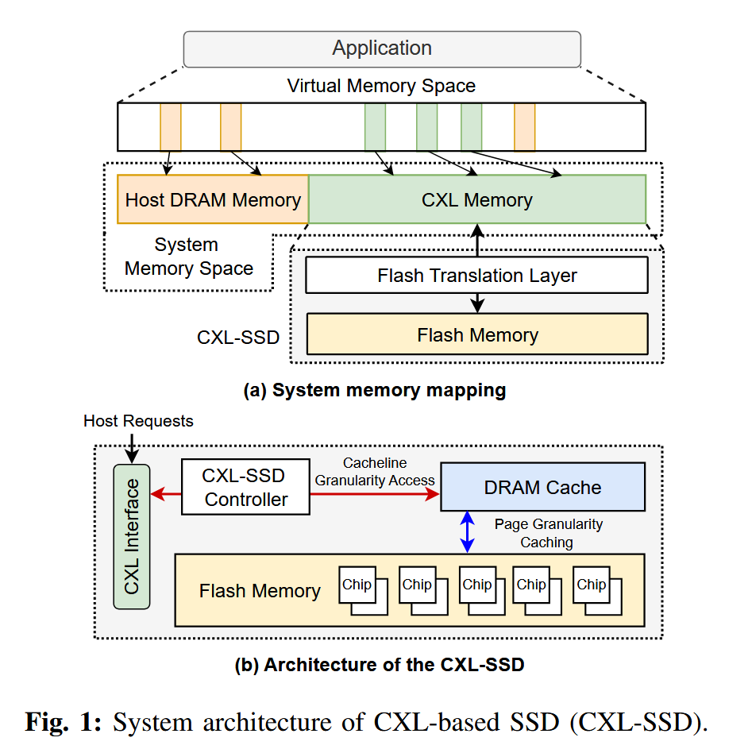

然而，与主机 DRAM 相比，CXL-SSD 具有不同的性能特性。因此，整个系统内存可以被视为一种异构内存系统。主机操作系统仍然负责内存放置策略以及虚拟地址到物理地址的映射管理，而 SSD 内部的闪存转换层（Flash Translation Layer，FTL）则负责将逻辑页地址（Logical Page Address，LPA）转换为闪存中的物理页地址（Physical Page Address，PPA）。

图 1(b) 展示了 CXL-SSD 的体系结构。当应用程序对 CXL-SSD 发起一次内存访问时，CXL home agent 会通过 CXL.mem 协议发送一条消息。随后，SSD 控制器对该消息进行解析，提取其中的内存请求，并通过与 SSD 固件协同来完成数据服务。为支持缓存行（64B）粒度的访问，控制器利用 SSD 内部的 DRAM 缓存来响应来自主机的内存请求。SSD 的 DRAM 会以页粒度缓存来自闪存芯片的数据。

### Challenges of Using CXL-Based SSDs

尽管 CXL 技术为具有内存语义的 SSD 的广泛应用提供了良好的机遇，但现有的操作系统和处理器体系结构并不能在开箱即用的情况下很好地支持 CXL-SSD。简单地将 CXL-SSD 视为传统的 DRAM 内存，会导致严重的性能下降。

* **长尾延迟**
  * 这些工作负载在 CXL-SSD 上的性能仍然比在 DRAM 上差 1.5–31.4 倍
  * 超过 90% 的 CXL-SSD 内存请求延迟低于 200 ns （得益于 SSD 内部的 DRAM 缓存）
  * 尾部延迟可高达数百微秒。当触发垃圾回收时，访问延迟还会进一步升高，例如达到数毫秒级

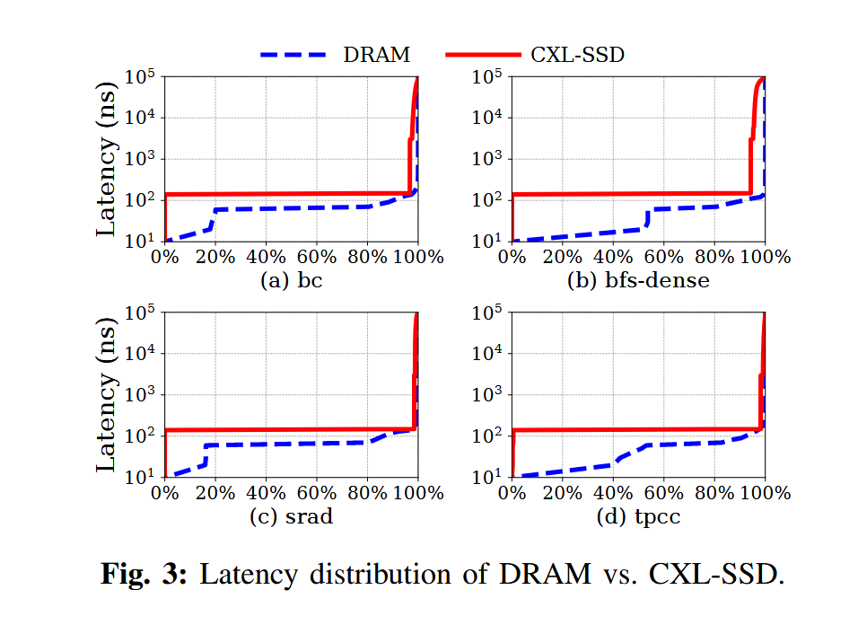

* 过度的处理器流水线stall

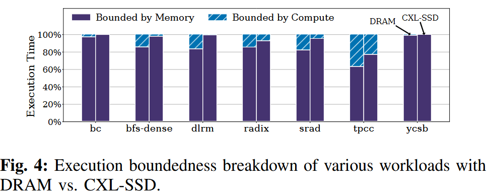

CXL-SSD 的长尾延迟会引发严重的处理器流水线停顿，从而导致性能下降以及 CPU 和 SSD 带宽利用率不足。

* 使用 DRAM 时 62.9%–98.7% 的周期受内存限制相比，使用 CXL-SSD 时内存受限周期的比例上升至 77%–99.8% (参考 Intel 的 Vtune 性能分析工具)

* 多加CPU能提升带宽利用率，但更多的CPU会stall，加剧计算资源的浪费

  * 处理器无法维持足够数量 inflight memory requests， 以充分利用 SSD 所能提供的带宽。

  * > 例如，要在单个 DDR5 通道上实现 32 GB/s 的带宽，且每个 64B 缓存行的访问延迟为 70 ns，至少需要同时发出 70 × 32 / 64 = 35 个并发内存请求。而在假设使用 PCIe 5.0 x4 接口、带宽为 16 GB/s 的情况下，要隐藏闪存的访问延迟（以当前最先进的 Z-NAND 为例，其读取延迟约为 3 μs），则需要同时维持 3000 × 16 / 64 = 750 个内存请求，这对于当今的处理器而言是不可行的。

* CXL 接口与闪存之间的访问粒度不匹配

为隐藏较长的闪存访问延迟，现代 SSD 通常采用以闪存页粒度进行管理的内部 DRAM 缓存，这是由于其主要面向块设备接口设计，且闪存芯片仅支持页粒度访问。因此，由于 CXL 接口采用 64B 缓存行粒度，而闪存内存采用 4KB 甚至更大的页粒度，二者之间的访问粒度不匹配，使得现有的 SSD DRAM 缓存设计在 CXL-SSD 场景下的效果显著下降。

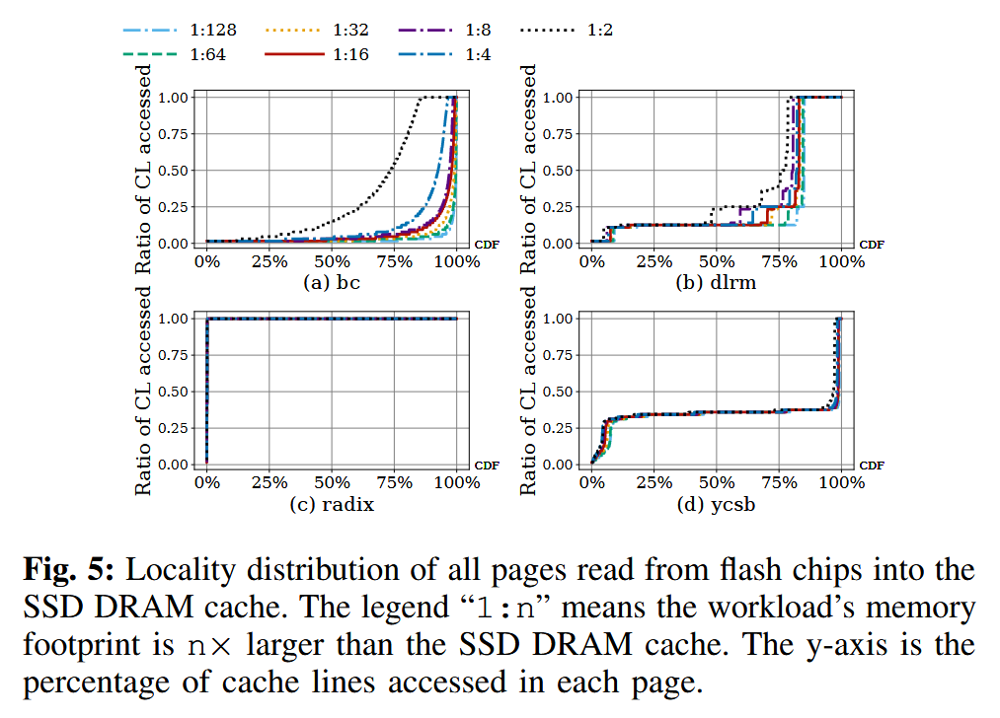

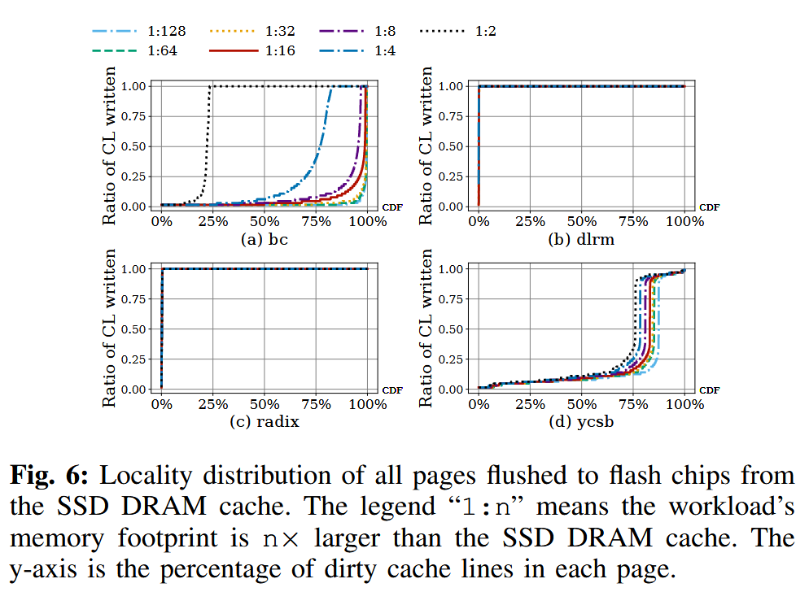

我们在图 5 和图 6 中量化分析了不同工作负载的内存访问模式。

* 许多工作负载在超过 75% 的页面中，仅访问了不足 40% 的缓存行
  * 当在 SSD 的 DRAM 中缓存整个页面时，由于页面中大多数缓存行并未被访问，DRAM 容量被严重浪费
  * 其次，即使一个页面中只有少量缓存行被写入，仍然需要将整个页面写回闪存，从而导致写放大，并缩短 SSD 的使用寿命。
* 除非 SSD 内部的 DRAM 足够大，能够容纳工作负载的全部工作集，否则单纯扩大 SSD DRAM 容量所带来的性能收益十分有限。

## Design

SkyByte 由三个主要组成部分构成：

* 基于长 SSD 访问延迟检测的协同上下文切换机制（第 III-A 节）
* SSD 控制器中采用的缓存行粒度、日志结构化的内存组织，用于弥合字节粒度的 CXL 接口与页粒度的闪存芯片之间的差距（第 III-B 节）
* 一种自适应页面迁移机制，通过以透明且一致的方式将热点页面迁移至主机内存，从而利用主机内存扩展 SSD DRAM 的有效容量（第 III-C 节）

### Coordinated Context Switch Mechanism

当某个线程因 SSD DRAM 缓存未命中而遭遇一次较长的 CXL-SSD 访问时，可以通过切换到另一个线程来更有效地利用 CPU 核心。然而，SSD 设备并不了解主机 CPU 的微体系结构状态，例如是哪个核心触发了内存访问未命中，以及该 load 操作是否为推测执行。同样，主机 CPU 也无法判断一次内存访问在 SSD DRAM 缓存中是命中还是未命中。因此，无论是 CPU 还是 SSD，都无法单独决定是否应触发上下文切换。

为在发生长时间 CXL-SSD 内存停顿时实现上下文切换，我们在主机操作系统与 SSD 控制器之间引入了协同机制。要实现这种协同上下文切换，需要解决以下三个问题：

（1）何时触发上下文切换；

（2）如何执行上下文切换；

（3）采用何种上下文切换策略。

为此，我们首先介绍协同上下文切换的具体流程，随后讨论用于决定触发上下文切换时机以及选择下一个执行线程的策略，最后说明实现该机制所需的硬件与软件修改。

#### 上下文切换流程

图 7 以主机 CPU 发起的一次 CXL 内存读操作为例，展示了上下文切换的具体流程。由于写请求会被缓存在写日志中（见第 III-B 节），因此写操作无需触发上下文切换。

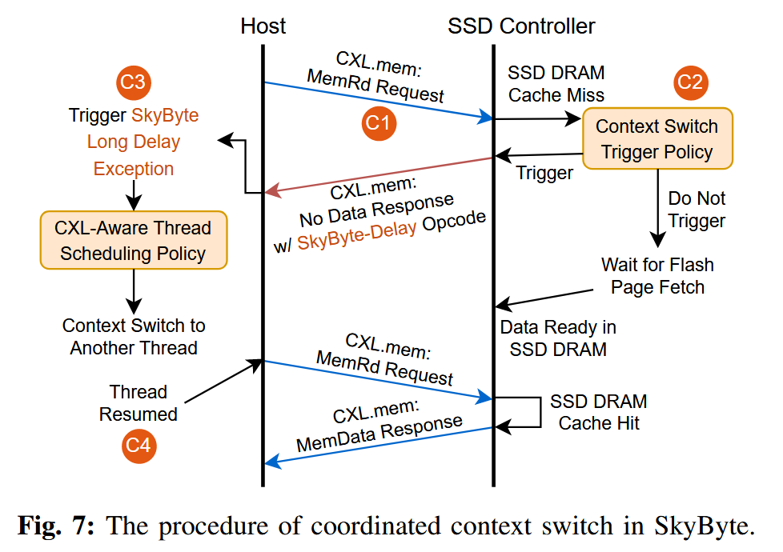

***C1** 发送带有跟踪信息的 CXL.mem 请求消息*

主机 CPU 向 SSD 控制器发送一条 CXL.mem 的 MemRd 读请求消息。默认情况下，CPU 会维护其微体系结构状态，包括共享 LLC 中的未命中状态处理寄存器（miss status handling registers，MSHR），用于跟踪是哪一个核心中的哪条 load/store 指令正在等待该内存请求的响应。MSHR 还负责执行内存访问合并，因此当来自不同核心的多条指令请求同一缓存行时，一个内存请求可能会关联到多条指令。CXL 控制器通过 CXL.mem 的 MemRd 消息，跟踪主机 CPU 与 SSD 之间的所有内存请求（见图 8）。

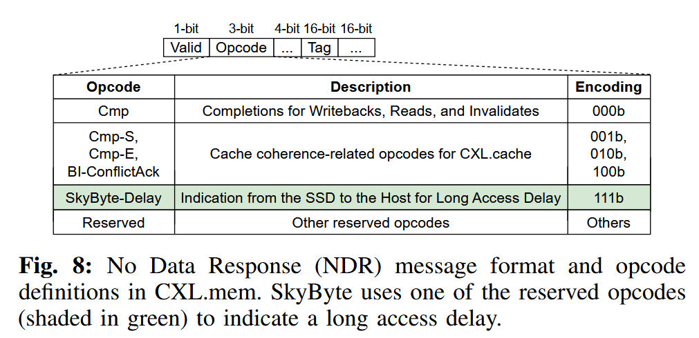

***C2** 通过扩展的 CXL.mem 无数据响应消息发送上下文切换请求*

当发生 SSD DRAM 缓存未命中时，SSD 控制器开始从闪存中读取相应的页面。此时，SSD 控制器会根据对访问延迟的估计结果，决定是否向主机操作系统发送上下文切换请求（具体策略将在后文的上下文切换触发策略中讨论）。SSD 控制器通过一条无数据响应（No Data Response，NDR）消息来发送该上下文切换请求。NDR 消息是一种从从设备到主设备（slave-to-master，S2M）的消息类型，用于表示某个 CXL 内存请求已经完成，但不向主机 CPU 返回任何数据。如图 8 所示，每一条 CXL.mem 事务的 MemRd 消息都包含一个 16 位的标记（tag）。SkyByte 对 NDR 消息规范进行了扩展，引入了一种新的操作码，称为 SkyByte-Delay。该操作码用于指示对应的 MemRd 请求将遭遇较长的访问延迟，例如由于发生了 SSD DRAM 缓存未命中。

***C3** 通过硬件异常触发上下文切换*

SkyByte 利用现代 CPU 中已有的硬件异常机制，精确地定位应当触发上下文切换的具体内存访问指令以及对应的处理器核心。SkyByte 定义了一种新的异常类型，称为 SkyByte 长延迟异常（SkyByte Long Delay Exception）

当主机 CPU 从 CXL 控制器接收到带有 SkyByte-Delay 操作码的 NDR 消息后，会查找该内存请求在 LLC 中对应的 MSHR 表项，并沿着上层缓存层级（例如 L1 和 L2 缓存）向上遍历，找出所有正在等待该内存响应且尚未提交的内存访问指令。当其中任意一条指令进入提交（retire）阶段时，就会在相应的处理器核心上触发 SkyByte 长延迟异常，这一过程类似于 load/store 指令触发缺页异常（Page Fault Exception）。

> SSD 先告诉 CPU：这次内存访问会很慢；
>
> CPU 先记住“是哪条指令在等”；
>
> 等这条指令快要真正执行完成时，CPU 人为制造一个“异常”，
>
> 借机把当前线程换下去。

> MSHR记录的是: "针对某一个 cache line 的一次未完成内存请求，目前系统里有哪些指令、哪些核心在等它，以及这个请求的状态是什么。"
>
> Cache Line Address (PA) / Request Type / Coherence / Permission / Waiting Instructions

在发生上下文切换时，该指令的地址会被保存下来，从而保证当线程再次被调度运行时，能够从该指令处继续执行，并重新向 CXL-SSD 发起相同的内存访问请求。

这种设计能够消除误触发的上下文切换，即某条 load/store 指令触发了上下文切换，但随后该指令又被回滚（squash）的问题；并且无需额外的硬件开销，因为现代处理器本身就会将异常的处理延迟到指令提交（retire）阶段。例如，投机执行的 load/store 指令以及硬件预取操作，即使发生了 SSD DRAM 缓存未命中，也不会触发任何异常。

SkyByte 在 x86 的中断描述符表（IDT）中为 SkyByte 长延迟异常注册了一个专用的异常处理程序。该异常处理程序会调用一种具备 CXL 感知能力的线程调度策略，以决定接下来应当执行哪个线程，并完成相应的上下文切换，具体细节将在后文中讨论。

***C4** 原线程的恢复执行*

当原线程再次被调度运行时，它将从之前触发 SkyByte 长延迟异常的那条未命中的内存访问指令处继续执行，并重新向 CXL-SSD 发起该内存访问请求。如果该指令在重新执行时命中了 SSD DRAM 缓存，数据将通过 CXL.mem 的 MemData 响应返回。

当一个线程发生上下文切换时，其所有尚未完成的 load/store 指令都会被回滚（squash）。然而，缓存层级中的 MSHR 是否被释放则取决于具体实现。在长闪存访问延迟的情况下，这可能导致不同线程之间出现严重的 MSHR 竞争。极端情况下，一个线程访问多个 4KB 页面中的 64 条缓存行，并且这些访问全部在 SSD DRAM 缓存中未命中，那么这些请求将在数微秒内至少占用 64 个 MSHR，很容易耗尽系统中所有的 MSHR 资源。

为了解决这一问题，SkyByte 在对应指令被回滚时立即释放其占用的 MSHR 表项。由于这一做法同样有利于主机 DRAM 的访问，SkyByte 默认启用该机制。当某个线程在被上下文切换走一段时间后再次被调度执行时，如果所请求的页面已经因为缓存冲突而被逐出 SSD DRAM 缓存，则可能再次触发 SSD DRAM 缓存未命中。不过这一问题并不严重，因为 SSD DRAM 缓存采用的 LRU 逐出策略在大多数情况下可以避免请求页面过早被替换。例如，在我们对多种数据密集型应用的实验中，并未观察到原线程在恢复执行并再次访问该页面之前，该页面就已经被逐出的情况。

> 如果线程因为 CXL-SSD 太慢被切走，但它占着的 MSHR 不释放，就会把整个 CPU 的内存系统“卡死”；SkyByte 通过在指令回滚时立刻释放 MSHR 来避免这个问题。
>
> squash = 指令被作废 / 回滚
>
> 当发生上下文切换时：线程 A 的所有还没完成的 load/store,都会被 CPU 强制作废, 它们会：(1) 从 ROB 里删除; (2) 不再执行; (3) 将来重新发射。
>
> SkyByte “只要指令被 squash，就立刻释放它占用的 MSHR”

#### 上下文切换触发策略

当发生 SSD DRAM 缓存未命中时，SSD 控制器可以选择触发一次上下文切换，或者让主机 CPU 继续等待数据返回。直观来看，如果上下文切换的开销小于访问 CXL-SSD 所需的延迟，那么通过上下文切换来隐藏这段延迟是有利的。

SkyByte 采用一种基于阈值的策略来决定是否触发上下文切换。SSD 控制器会估计从闪存芯片中读取所请求页面的访问延迟；如果该估计延迟超过预设阈值，则触发一次上下文切换。该阈值可以根据主机的上下文切换开销进行调整。算法 1 给出了基于阈值的上下文切换触发策略的具体流程。

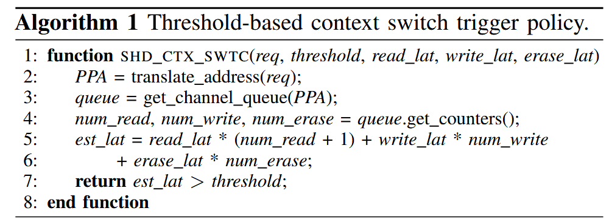

具体而言，SkyByte 首先查询 FTL 映射表以获得对应的物理页地址（PPA），从而确定该请求将被发送到哪个闪存通道（第 2–3 行）。随后，它通过查询相应闪存控制器的队列状态（即队列中已有的请求数量）来粗略估计闪存访问延迟（第 4 行）。通常，同一通道队列中的请求会按照 FIFO 顺序被服务，因此，类似于以往研究中的方法，SkyByte 通过累加队列中所有请求的延迟来较为准确地估计当前请求的等待时间（第 5–6 行）。如果估计的延迟超过阈值，SkyByte 就会触发一次上下文切换（第 7 行）。

如果某个请求被正在进行的 GC 操作阻塞，SkyByte 会立即触发上下文切换，因为 GC 通常持续数毫秒。虽然 GC 会阻塞队列中请求的发出，但其影响已经通过查询闪存通道队列状态被纳入到延迟预测算法中。

为了设置合适的阈值，可以测量主机 CPU 上下文切换的平均开销。图 9 展示了在不同阈值设置下，若干代表性工作负载的性能表现。由于本文所用 SSD 的闪存页读取延迟（默认 3 μs）大于常规上下文切换开销（在表 II 所示硬件平台上测得约为 2 μs），因此我们将阈值设置为 2 μs。在实际系统中，该阈值可以根据不同 CPU 和系统配置通过实验进行调优，SkyByte 也允许主机操作系统对其进行配置。

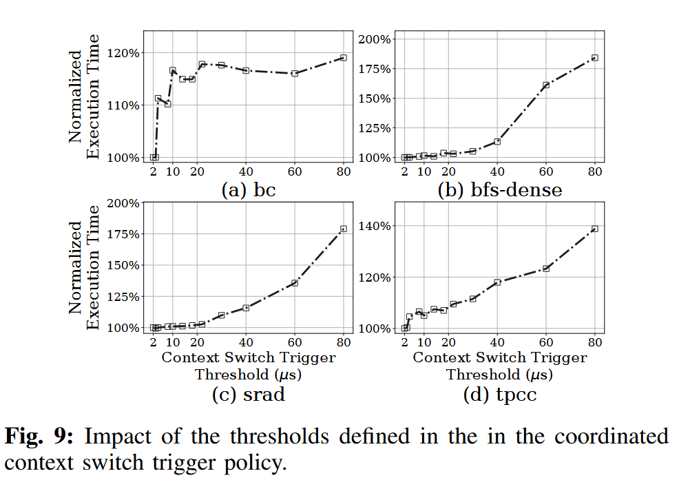

> 看起来这个实验没有做的必要？？ 

#### 面向 CXL 的上下文切换的操作系统支持

为了支持“长延迟异常”，我们在 x86 的中断描述符表（IDT）中安装了一个新的异常处理程序。当该异常被触发时，异常处理程序会让当前线程主动让出其占用的 CPU 资源。随后，系统调度器根据预先定义的调度策略决定接下来运行的线程。被让出的线程会重新加入操作系统的运行队列，从而在之后再次被调度执行。

我们在 Linux 操作系统中评估了三种调度策略，用于选择下一个可运行的线程：(1) 轮转（Round-Robin，RR）策略，线程依次轮流执行；(2) 随机（Random）策略，随机选择一个线程执行；(3) 完全公平调度器（Complete Fairness Scheduler，CFS）策略，该策略优先选择已获得执行时间最少的线程，以保证各线程公平地共享 CPU 时间片。

我们对这三种策略的性能进行了评估，并按照图 4 中对“受限类型”的定义，在图 10 中给出了执行时间的分解结果。实验表明，这三种调度策略的性能表现非常接近。这是因为所有线程主要都受限于内存 I/O，而这三种策略都能为各线程提供相同或相近的机会向 SSD 发起内存请求，即使这些线程在被调度后很快又会因为等待闪存访问而触发上下文切换。多线程并行发起请求能够提升 SSD 带宽的利用率

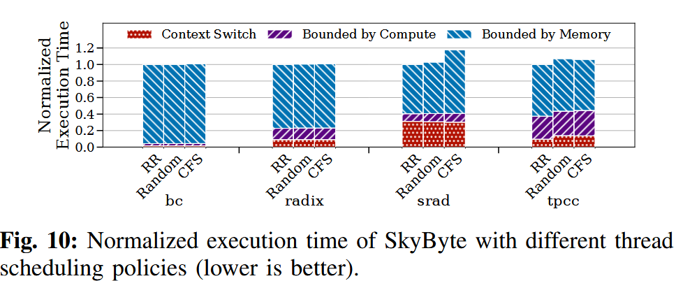

对于某些工作负载（例如 srad），上下文切换会占据相当一部分时间，因为所有线程在等待闪存访问时都会反复触发上下文切换。在少数工作负载中，CFS 策略的性能可能略差，这是因为它需要严格保证线程之间的公平性，可能会导致操作系统再次选择那些刚刚因为 SkyByte 触发的上下文切换而被调度出去的线程。不过，这种影响对整体端到端性能来说是微不足道的。鉴于 CFS 已经成为现代操作系统（如 Linux）中的标准调度策略，SkyByte 默认采用 CFS。

### CXL-Aware SSD DRAM Management

*"SkyByte 通过“二级哈希表按需扩容”的方式，在保证快速查找的同时，大幅降低了写日志索引的内存开销。"*

如第 II-C 节所讨论的，由于 CXL 接口与闪存之间在访问粒度上的不匹配，SSD 内部的 DRAM 缓存往往难以高效工作。一次缓存行级别的访问请求可能会触发一次闪存页级别的访问，这不仅会带来较长的访问延迟，还会浪费宝贵的 SSD DRAM 容量。为了解决这些问题，我们对 SSD DRAM 的组织方式进行了重新设计，如图 11 所示。

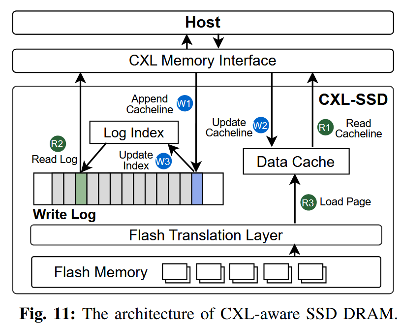

SkyByte 在 SSD 中引入了一种以缓存行为粒度的双缓冲写日志，用于缓冲来自主机的所有写请求。所有缓存行级别的写操作都会被直接追加到日志中，在关键路径上无需访问闪存，真正写入闪存的过程会在之后延迟进行。与页粒度缓存相比，这种写日志机制具有两方面的优势：

* 在写访问局部性较差时，更细粒度的缓存方式可以节省宝贵的 SSD DRAM 空间
* 写日志提供了更大的写合并窗口，有助于将多个小写请求合并，从而显著减少写入闪存的流量

此外，SkyByte 维护了一张日志索引表，用于在处理读请求或进行日志压缩（log compaction）时，快速定位写日志数组中对应的最新数据。

对于读操作而言，一旦发生 SSD DRAM 缓存未命中并且不可避免地需要访问闪存，就必须从闪存中读取整个页面。因此，SkyByte 使用一个以页为粒度管理的读写数据缓存来缓存从闪存中取回的页面，以利用数据的空间局部性。

为了保持写日志与数据缓存之间的数据一致性，SkyByte 在处理写请求时同时更新写日志和数据缓存；在处理读请求时，则优先检查写日志中的最新数据。为提升访问性能，SkyByte 在写入时对写日志和数据缓存进行并行更新，在读取时对二者进行并行查找。

写日志和数据缓存均使用逻辑地址进行索引，因为它们构建在闪存转换层（Flash Translation Layer，FTL）之上。下面将分别对这两个结构进行详细说明。

#### Write log structure

图 12 展示了写日志的结构。该日志通过一个带有头指针和尾指针的环形缓冲区，记录所有被写入的 64B 缓存行。为了实现对日志项的快速查找，SkyByte 采用哈希表进行索引，因为哈希表能够提供摊还 O(1) 的查找时间复杂度。然而，普通的哈希表会将日志项随机分布，这会导致在日志压缩（compaction）过程中，需要多次查找才能找到同一页面内的所有缓存行。

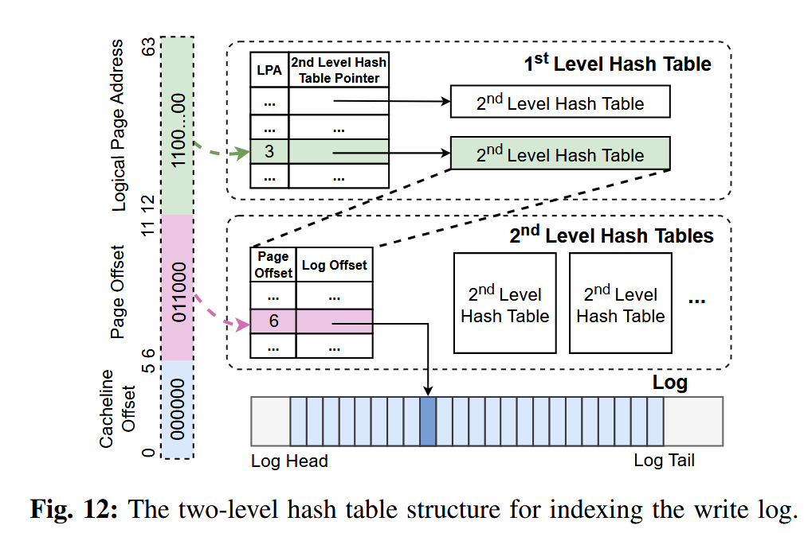

为了解决这一问题，SkyByte 将索引结构设计为两级。第一级使用以逻辑页地址（LPA）为索引的哈希表。每一个有效的一级表项都会指向一个二级哈希表，用于记录该逻辑闪存页中所有已写入缓存行的信息及其在页内的偏移位置。对应缓存行在写日志中的位置（日志偏移）则记录在二级哈希表中。通过遍历相应的二级哈希表，系统可以方便地找出同一页面中所有被更新过的缓存行。

在一级哈希表中，每个表项存储一个 8B 的逻辑页地址（LPA）以及一个 8B 的二级哈希表指针，对应一个逻辑页。由于每个页面大小为 4KB，包含 64 条缓存行，因此只需要 6 位即可表示页内偏移。二级哈希表中的每个表项大小为 4B，其中包括 6 位的页内偏移和 26 位的日志偏移。

以一个 64MB 的写日志为例，其包含 100 万个日志项。如果在最坏情况下为每个页面都预先分配包含 64 个表项的完整二级哈希表，那么当每个页面只有一条被修改的缓存行时，索引结构将需要高达 272MB 的内存开销。为降低内存占用，SkyByte 并不会一开始就分配完整大小的二级哈希表，而是采用按需扩展的方式，先分配小尺寸的二级哈希表，并在需要时进行扩容。

具体而言，SkyByte 为每个二级哈希表初始分配 4 个表项（共 16B），当表的负载因子超过某一阈值（默认 0.75）时，就将表的大小扩大一倍。通过这种动态扩展机制，即使在最坏情况下，索引结构的内存占用也最多约为 32MB（包括 100 万个 16B 的一级哈希表项以及 100 万个 16B 的二级哈希表）。在我们基于真实工作负载轨迹的实验中（见第 VI 节），写日志索引结构的平均内存占用仅为 5.6MB。

#### Read operation

图 11 展示了读写操作流程。当一个读请求到达时，SSD 控制器会**并行**查找数据缓存（data cache）和写日志（write log）。

* 如果请求的数据已经缓存在数据缓存中，则直接从数据缓存中读取并返回给主机（R1）。
* 如果数据缓存未命中，但写日志中保存了该 cache line，则 SkyByte 从写日志中取回该数据（R2）。
* 如果写日志和数据缓存都未命中，则需要从闪存中读取**整个页**并加载到数据缓存中，然后返回目标 cache line（R3）。

由于写日志中可能包含最近被更新过的 cache line，需要保证缓存中的页数据是最新的。因此，在将页从闪存加载到数据缓存之后，SkyByte 会查询一级哈希表；如果发现该页在写日志中有对应条目，就会遍历其二级哈希表，将写日志中该页对应的所有 cache line 合并（merge）到刚加载的数据缓存页中。

#### Write operation

在写请求到达时，SkyByte 会将被写入的缓存行直接追加到写日志的尾部（W1）。如果数据缓存中已经包含对应的页面，则会并行地对数据缓存进行更新（W2）。同时，SkyByte 还会更新索引表（W3）。如果该写操作更新的是写日志中已经存在的某条缓存行，SkyByte 会将索引表中的对应项更新为指向最新的日志偏移位置。

#### Write log compaction

图 13 展示了 SkyByte 执行写日志压缩（log compaction）的过程。为了减少对闪存芯片的写入流量，SkyByte 会在日志压缩阶段对写操作进行合并。由于索引表中只跟踪最新的数据，旧的更新在压缩过程中会被丢弃。

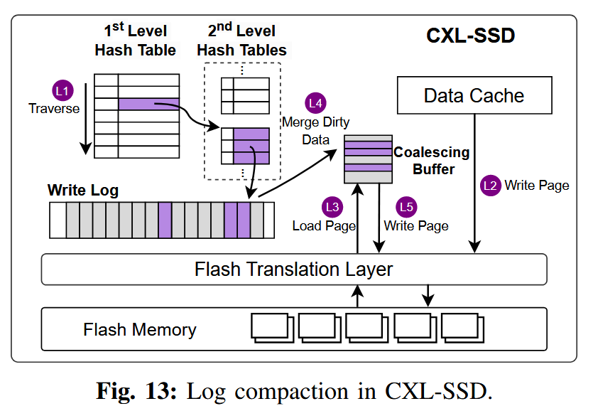

SkyByte 首先扫描一级哈希表，找出所有需要被回写到闪存的页面（L1）。对于每一个页面，如果该页面已经缓存在数据缓存中，则直接将缓存中的页面写回闪存（L2）；如果该页面不在缓存中，则先从闪存中将缺失的页面读入到一个合并缓冲区（L3）。接着，SkyByte 遍历该页面在二级哈希表中对应的所有脏缓存行条目，并将这些缓存行与加载的页面进行合并（L4）。合并完成后的页面随后被写回闪存（L5）。

在执行闪存写入时，SkyByte 会在写缓冲区中对页面进行批量处理，并将写操作分散到多个通道上，以充分利用 SSD 的通道并行性。SkyByte 维护了一个双缓冲的写日志结构，以避免阻塞新的请求，并在后台执行日志压缩。当其中一个日志写满时，SkyByte 会触发日志压缩过程并切换到一个新的日志；在压缩过程中，新到达的写请求会按照正常的写流程写入新日志。对于读请求，需要同时在新旧两个日志中并行查找最新的数据。

由于后台日志压缩不处于内存请求服务的关键路径上，因此不会引入明显的性能开销，单次压缩的平均耗时约为 146 微秒。压缩完成后，SkyByte 会删除旧日志对应的索引表，并回收其占用的内存。

### Adaptive Page Migration

*“基本就是已有的机制”*

由于 SSD 内部 DRAM 容量有限，SkyByte 利用主机内存来扩展 SSD 的 DRAM 缓存。SkyByte 设计了一种自适应的页面迁移机制，将被频繁访问的页面迁移到主机内存中。为了决定哪些页面需要迁移，SkyByte 采用了与已有研究 [7]、[8]、[14]、[19]、[35]、[48]、[61] 类似的策略：SSD 控制器会跟踪闪存页面的访问次数，并将访问次数超过某一阈值的页面选为迁移候选。

SkyByte 只迁移位于 SSD DRAM 缓存中的页面，因为这些页面包含了候选的热点数据。在选定迁移目标页面后，SSD 通过发送一个携带 SSD 页面地址的 PCIe MSI-X 中断来触发迁移过程。主机操作系统随后使用默认的伙伴分配器在主机 DRAM 中分配一个物理页面，并将页面内容拷贝到新的页面中。

在页面迁移过程中需要保证数据一致性。一种简单的方法是利用操作系统机制，在迁移前将正在迁移的页面在页表项（PTE）中标记为不存在，并修改缺页异常处理程序，在迁移完成后重新执行该请求。然而，这种方法会带来较高的性能开销。SkyByte 参考已有工作 [7]，在根复合体（root complex）中引入了一个提升旁路缓冲区（Promotion Look-aside Buffer，PLB）来跟踪迁移进度。

PLB 包含 64 个表项，每个表项大小为 24 字节，用于记录正在进行的迁移，包括源页面和目标页面的地址（各 8 字节）、一个表示缓存行是否已迁移的位图（8 字节），以及一个有效位。因此，当对正在迁移的页面发起读请求时，可以直接从 SSD DRAM 中提供数据；对于写请求，如果对应缓存行的迁移位已经被置位，则请求会被转发到主机 DRAM 中该缓存行的最新副本。

在数据迁移完成后，主机操作系统会修改页表项（PTE），将原虚拟地址映射到新的主机 DRAM 页面，并相应更新 TLB。随后，主机操作系统向 SSD 确认迁移完成，SSD 会将该页面从数据缓存中移除，并通过将对应索引项置为 NULL 来使写日志索引失效。

由于主机 DRAM 空间同样有限，SkyByte 还允许主机将页面回迁到 SSD 以释放空间。SkyByte 利用 Linux 中已有的页面回收策略 [3]，通过 active/inactive 链表 [6] 选择相对“冷”的页面进行驱逐。随后在 CXL 内存空间中分配一个新页面，并执行页面拷贝操作。主机操作系统会更新相应的页表项，使其指向 SSD 页面，并更新 TLB。

实验略过，但这篇文章做的实验非常多。