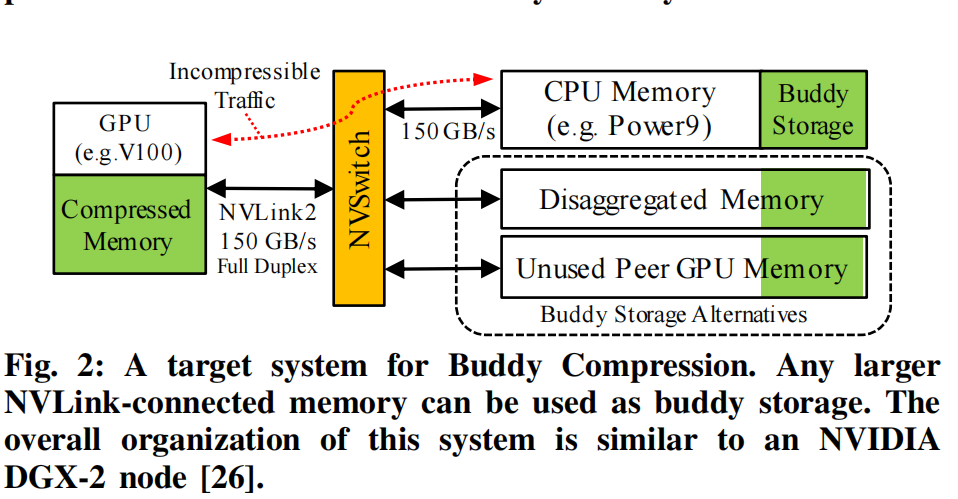
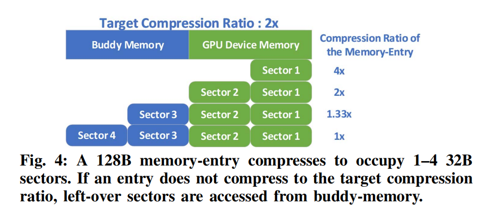
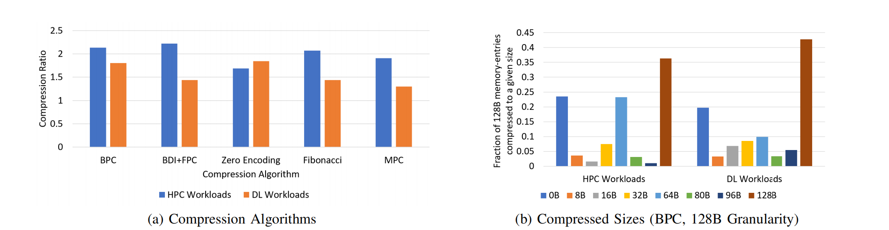
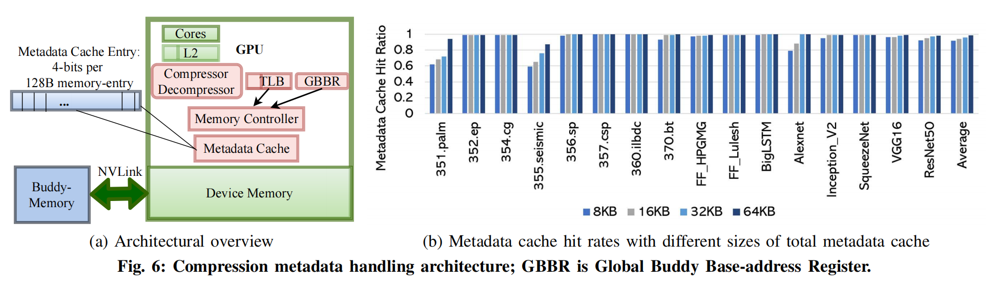

# [ISCA'20] Buddy Compression

**Title:** Buddy Compression: Enabling Larger Memory for Deep Learning and HPC Workloads on GPUs

**Keywords:** Compression ; GPU Memory ; Buddy system

**Major Contribution:**

* 论文首次推出了使用通用压缩技术来提高 GPU 内存容量的设计。Buddy 压缩是独一无二的，因为当数据的可压缩性发生变化时，它不需要任何额外的数据移动。
* 提供了对具有代表性数据的GPU工作负载的内存值的深入分析，并获得了有效的GPU压缩的见解。
* 伙伴压缩平均可实现1.9×（HPC）或1.5×（DL训练）压缩，并在无约束内存容量GPU的2%范围内执行。
* 最后，提出了一个关于DL训练的案例研究，以了解使用伙伴压缩来扩大GPU内存容量的好处和权衡。

------

## 本文简介

GPU加速了高吞吐量的应用程序，这需要比传统的仅CPU系统更高数量级的内存带宽。然而，这种高带宽存储器的容量往往相对较小。伙伴压缩是一种架构，它利用了主机更大的伙伴内存或分解内存，有效地增加了GPU的内存容量。伙伴压缩将每个压缩的128B内存条目分为高带宽GPU内存和较慢但较大的伙伴内存之间，这样可压缩内存条目完全从GPU内存访问，而不可压缩条目从非GPU内存中获取部分数据。使用“伙伴压缩”，可压缩性的变化不会导致昂贵的页面移动或重新分配。对于代表性的HPC应用，伙伴压缩平均实现1.9×的有效GPU内存扩展，对于深度学习训练，平均实现1.5×，执行在没有内存限制的不现实的系统的2%以内。这使得Buddy压缩对需要额外GPU内存容量的性能意识开发人员具有吸引力

------

## 相关简介

### Read-Modified-Write

读改写操作，即先读出存储器中的数据，对其进行修改后，再写入存储器。这样的操作其实在大多数情况下都是非常简单的，不值一提，但是在某些有性能要求的场景下，就需要一些考虑。

### Bit-Plane Compression (BPC)

是一种被广泛使用的压缩方法，尤其在高性能计算和深度学习工作负载中，它能达到稳健的压缩比。这种压缩方法的基本思想是将数据分解成一系列的"bit-planes"，然后独立地压缩每一个 “bit-plane”。具体来说，首先，BPC 将每个数据项分解成一系列的二进制位（即 “bit-planes”）。例如，一个32位的浮点数可以被分解成32个"bit-plane"。然后，BPC 对每个 “bit-plane” 进行压缩。通常，高位的"bit-plane"（表示更大的值）包含的信息更少，因此可以被更大程度地压缩。BPC 的一个主要优点是，它可以按需解压缩数据。也就是说，如果一个计算只需要数据的一部分信息（例如，只需要高位的"bit-plane"），那么只需要解压缩相应的 “bit-plane” 就可以了。这可以进一步提高计算效率。

------

## Introduction

gpu被广泛用于高内存占用的应用程序，包括高性能计算（HPC）和深度学习（DL）。HPC的应用，如平面尺度的模拟和流体和分子动力学的建模，已经发展到需要非常大的模型。DL网络也在增长，它们的模型尺寸要么太大，无法在GPU上运行，要么足够大，只有一个小批量可以放在GPU上运行，可能导致低利用率和准确性问题。

尽管内存需求不断增加，但计算类GPU可能会**继续优先考虑内存速度而不是容量**，以**保持其许多并行内核**的繁忙。高带宽内存（HBM）必须适应有限的包空间和芯片外围，这样即使是目前(2020年)最高容量的GPU也只有4个HBM堆栈站点，导致最大容量为32GB。同时，非HBM图形DDR内存不能以每个通道超过1级的速度高速驱动，并且通道的数量已经接近实际的引脚计数限制。因此，与CPU或其他网络连接设备相比，像GPU这样的加速器总是具有相对有限的最大容量。

目前，具有大内存占用的应用程序必须求助于没有吸引力的选项来弥补有限的GPU内存。他们可以

* 扩展到许多GPU容量目的（无效利用资源）

* 显式协调CPU和GPU之间的数据移动保持在设备内存限制（添加算法复杂性）

* 依赖off-GPU内存访问或统一内存自动超订阅设备内存（限制性能）。

  本文探讨了内存压缩作为一种性能和通用的GPU内存扩展的替代方案

虽然已经研究了CPU的主内存压缩，GPU架构提出了非常不同的权衡。CPU压缩技术假设压缩后的页面大小不同，当可压缩性改变时，它们会重新分配页面。这样的**动态页面重新分配在GPU中将会非常昂贵**，因为它们有巨大的内存带宽[17]。此外，虽然特定于领域的压缩已经被提议用于大内存占用的GPU工作负载，但用于容量的通用压缩仍未被探索

> T. Zheng, D. Nellans, A. Zulfiqar, M. Stephenson, and S. W. Keckler,“**Towards High Performance Paged Memory for GPUs**,” in Proceedings *of the International Symposium on High Performance Computer* *Architecture (HPCA)*, 2016.

图1展示的是GPU侧和Buddy memory(容量更大但是更慢一侧（主机内存或者分散内存）)进行的划分。它将每个压缩的128B内存条目分割到高带宽的GPU内存和一个较慢但更大的伙伴内存之间。这样，可以被压缩的内存条目完全从GPU内存中获取，而无法压缩的条目则从离GPU较远的内存中获取部分数据。压缩后的大小在128B以下的，可以直接从GPU内存中读取。压缩后，大小在128B以上的，128B的部分在GPU内存中读取，而超过的部分在伙伴内存中读取

如果数据的可压缩性随时间而变化，这种设计不需要重新分配或移动页面。像NVLink 、OpenCAPI 或CXL这样的**高带宽互连**可以实现这种设计，因为它**确保了对伙伴内存的低开销访问**，只要大部分数据压缩以适应GPU设备内存

## Overview and Background

### 目标负载

**高性能场景**

现在应对高性能场景对GPU内存容量大小的要求通常是根据Unified Memory这种和CPU共享的虚拟内存进行优化。具体可以参见博客ASPLOS页面中DeepUM的部分。本文是一种更一般且性能良好的替代方案。

**深度学习负载**

深度学习的广度和深度的不断增加会导致出现更多的数据从而撞内存墙。一些领域定制的优化堆栈的方法可能有在训练迭代的过程中进行异步卸载。Buddy Memory可以在扩展深度学习内存容量这一方面上与领域定制方法正交或者互补。它不会对具体优化算法有改变。伙伴压缩可以省略可压缩数据的所有通信，而DL卸载必须在每次迭代中传输一些数据。这种带宽的减少可能会提高性能，它可能允许伙伴压缩操作与显著降低的能耗。

### 相关工作

**内存压缩** 内存压缩已以各种形式用于扩展有效的CPU内存容量。大多数现代操作系统都会压缩交换空间，以减少对磁盘的分页操作。与CPU内存容量的压缩不同，由于GPU数据的结构差异和频繁的压缩变化，这些方法效率低，不适用于通用GPU内存容量压缩。大多数GPU的图形管道包括特定于领域的有损纹理内存压缩，以减少图形纹理的足迹。据本文作者所知，硬件压缩目前还没有用于GPU上的通用计算工作负载。

### 相关技术

**高带宽互连** 高带宽互连是伙伴压缩的关键启用器，可以应用于任何具有主机内存高带宽互连的GPU上。

**UM**  参见博客ASPLOS DeepUM中的相关介绍

## Buddy Compression设计与实现

图上显示的内存占用了64B，伙伴内存占用了64B。这是由目标压缩比2x计算出来的。每一个sector是一个32B大小的扇区，对于每一个数据块，我们首先对他进行一个压缩。根据压缩比来确定要压缩多少，选择对应的压缩算法去压缩就可以了。

* 当4x压缩的时候，压缩完就可以剩下32B了，可以直接在内存中读取
* 当2x压缩的时候，压缩完就剩下64B了，可以直接在内存中读取
* 当1.33x压缩的时候，压缩完由32B需要从伙伴内存中读取
* 当不压缩也就是1x的时候，64B从内存中读取，64B从伙伴内存中读取
  

硬件内存压缩算法应该是快速的，只需要很少的能量，但会导致高压缩率。图5a比较了几种低成本的压缩算法。位平面压缩（BPC）是最具吸引力的伙伴压缩，因为它在HPC和DL工作负载上都实现了健壮的压缩比。由于伙伴压缩是与算法无关的，它将与任何低成本的硬件压缩算法能够协同工作。

大多数CPU主内存压缩策略都按照**缓存块粒度**进行操作，以**避免读-修改-写（RMW）开销**。伙伴压缩共享这个设计决策，并使用128B压缩粒度来匹配GPU缓存块大小。

### Buddy Memory的剥离区域

在启动时，驱动程序为每个GPU划出一个连续的固定buddy-memory区域。这些区域永远不会被主机CPU直接访问，从而消除了任何一致性问题，并使得buddy-memory的地址转换简单且快速。

### 地址翻译

访问压缩数据需要额外的地址转换和元数据，这些数据可以告知

* 目标压缩比
* 特定记忆条目是否被压缩到目标比率
* 没有压缩到目标比率的内存条目访问伙伴内存中的地址。

伙伴存储分割区域的全局基本物理地址存储在全局伙伴基本地址寄存器中（GBBR）

GPU 的页表和 TLB 被**增强**以存储页面是否被压缩（1 bit）、目标压缩比（3 bits）以及 buddy-page 从全局基地址的偏移量的信息。

### 元数据

Buddy Compression 适用于 GPU 固定内存。支持 CPU 共享（UM 或 ATS）内存需要额外的地址转换机制和系统级模拟，这部分被留给未来的研究（也就是不支持）。Buddy Compression 将地址转换元数据存储在 GPU 页表中，非 GPU 对等体无法访问这些转换元数据，因此他们无法请求到 Buddy-Compressed GPU 内存

每个128B内存条目的压缩大小使用4位的元数据。将这些元数据存储在设备内存中由驱动程序分配的专用区域内，存储开销为 0.4%。尽管选择的压缩大小严格地只需要每个压缩缓存线有 5 个状态（3 bits），但论文保留 4 bits 的元数据以对齐到 2 的幂，并为其他用途或未来的压缩变化预留状态。

缓存用于避免具有良好局部性的工作负载的元数据流量。图6b显示了元数据缓存命中率作为元数据缓存大小的函数。大多数应用程序的命中率都很高。我们使用一个4路64KB的元数据缓存，它被分成8个切片，每个内存控制器1个。每个128B个元数据缓存条目被分成4个32B个扇区，从而导致每个元数据扇区上的63个相邻内存条目对应的元数据预取丢失。元数据使用与常规物理地址交错相同的哈希机制跨HBM2通道进行交错。图6a显示了元数据设置和转换的高级视图。简单的基于GBBR-偏移量的寻址使得整个转换机制易于实现。

------

## Buddy Compression Benefits

### No page-faulting expense

GPU的巨大并行性增加了其整体吞吐量。然而，基于驱动程序的页面故障处理是远程的和非分布式的，这使得GPU页面故障代价昂贵。内存中数据的可压缩性可能会降低，这需要为以前的基于CPU的内存压缩方案进行新的页面分配。GPU 的页面故障开销使得这些基于 CPU 的压缩方案难以为继。伙伴压缩的独特之处在于，**每个内存条目的可压缩性只影响其自身的分配，而可压缩性的变化永远不会导致页面移动或重新分配**。**如果内存条目的压缩大小超过设备分配，其上部扇区溢出到伙伴内存；如果压缩大小减小，陈旧但从未访问的值将保留在伙伴内存中，直到分配被释放。**

### **Low Translation Overhead**

内存带宽是GPU偶尔出现的瓶颈。相应地，对GPU主存的带宽压缩进行了深入的研究。伙伴压缩使用压缩来放大GPU内存的带宽和容量。然而，如前面所述，容量压缩需要额外的元数据访问才能翻译到压缩的地址空间，这强调了减少元数据大小和保持翻译简单的重要性。伙伴压缩只需要0.4%的元数据，而且由于伙伴内存分割区域在物理上是连续的，所以地址进入它是基于偏移的和直接的。

## 降低Buddy Compression的开销

在伙伴压缩的设计中，主要的开销来自于在意外的**低压缩的情况下访问较慢的伙伴内存**。

### **分析目标压缩比率**

选择合适的目标压缩率非常重要，因为激进的压缩率会导致更多内存条目超出分配的设备内存，并需要伙伴内存访问。

为了选择目标压缩比，我们对一个具有代表性的数据集使用一个简单的分析传递。对于HPC工作负载，分析过程使用一个更小的数据集运行，比如SpecACCEL的`train`数据集。对于DL工作负载，一个简短的分析过程以较小的批处理大小运行，这可以嵌入到PyTorch或TensorFlow等训练平台中。

### 理解压缩模式

程序员对内存进行注释的粒度也很重要——最好的注释的粒度取决于空间可压缩性模式。幼稚伙伴压缩考虑了整个程序的一个单一的、保守的目标压缩比。图7显示了这个粒度过于粗糙。该朴素机制实现了HPC工作负载的总体压缩比仅为1.57×，DL工作负载为1.18×，HPC的伙伴内存互连访问率为8%，DL为32%。

为了研究适当的伙伴压缩注释粒度，图8显示了每个工作负载的可压缩性的空间图（在虚拟地址空间中）。每个子图都是一个空间热图，显示由基准分配的内存的可压缩性。**较冷的颜色（蓝色）表示高压缩性，而较热的颜色（红色）表示低压缩性**。该图的结构是，每行有64 128个B个内存条目。图8显示了可压缩性的空间局部性在不同的基准测试中存在显著差异。虽然大多数HPC基准测试具有类似可压缩性的大同质区域，但在DL工作负载中分布更加随机。FF HPGMG显示了特定的可压缩性模式，这可以与它对数据结构使用异构结构的数组相关联。尽管DL工作负载没有显示在HPC工作负载中可以看到的同质性水平，但图表中仍然包含一些以红色或蓝色为主的区域。基于这些图的见解，我们建议进一步优化伙伴压缩的设计。

### 预分配压缩目标

图8显示，大多数基准测试都具有具有**相似可压缩性的大型同质区域。我们发现这些区域的边界大部分与GPU的malloc（）边界重叠**。一个针对压缩区域的特殊分配API允许我们捕获这种行为，并消除压缩红色区域的无用努力。

### 启发式伙伴压缩阈值

大多数基准测试的可压缩性具有高度同质的分配，这使得每个分配的目标比率决策变得简单。然而，对于像AlexNet和ResNet50这样的基准测试，内存分配具有混合的可压缩性，这意味着我们必须在压缩比和伙伴内存访问的频率之间进行权衡。为了指导我们的每个分配启发式，我们定义了一个伙伴阈值元启发式，它限制了伙伴内存访问的预期分数。更高的伙伴阈值可以实现更高的压缩比，但代价是更多的伙伴内存访问和更低的性能。

### 零分配的特殊情况

空间图显示了在整个基准测试中基本保持为零的记忆区域。为了获得这种分配的容量扩展机会，我们增加了一个16×的积极目标压缩比，其中我们在设备内存中每个128B中只保留8B。唯一的更改是在TLB中对页面大小的额外编码。
