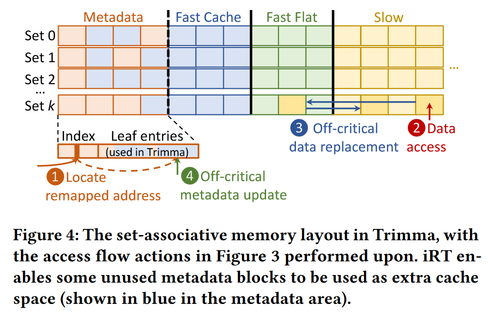

# Trimma (PACT'24)

【Title】Trimma: Trimming Metadata Storage and Latency for Hybrid Memory Systems

**速通版，只看design**

## Design

我们提出了一种名为 **Trimma** 的多级元数据结构，专为混合内存系统设计，采用高效的存储和缓存机制。Trimma 兼容快内存的**缓存模式**、**平坦模式**，甚至两者的混合模式 [2, 22, 39, 74]。它对应用层和系统软件完全透明。

Trimma 采用基于间接寻址的重映射表（iRT），有效消除了存储冗余元数据条目的需求。通过显著减少重映射表的大小（最高可达93%），Trimma 将节省的快内存空间用作额外的 DRAM 缓存区域，从而提升系统性能。

此外，为克服多级表查找带来的额外延迟开销，Trimma 还集成了高效的**身份映射感知重映射缓存（iRC）**。通过采用不同的缓存条目格式分别存储身份映射和非身份映射，iRC 的整体命中率得以提升，从而进一步增强了系统性能。

### Design Overview

图2展示了Trimma的整体架构。Trimma基于一个基本的混合内存设计构建，该设计将快速内存用作DRAM缓存或平坦内存空间的一部分，甚至是这两种模式的组合，如Chameleon[39]和Hybrid2[74]。快速和慢速内存空间都被划分为块，作为两个层级之间缓存/迁移的粒度单位。

在数据访问过程中，为了将物理地址转换为设备地址，Trimma使用一个前向重映射表作为其元数据，类似于传统的线性重映射表，但使用了后文描述的不同数据结构。这个重映射表存储在快速内存中，占用了本可用于实际数据的宝贵容量。两个内存中的所有块都被划分为不相交的集合，如图4所示的组相联组织。块仅在每个集合内的两个层级之间进行缓存/迁移，因此每个集合单独跟踪其元数据。Trimma在高相联配置下特别高效。

图3展示了访问快速或慢速内存中操作系统可见平坦区域的物理地址的整体访问流程，图4显示了内存布局上的相应操作。由于数据可能被缓存或迁移到其他地方，我们首先通过查询片上重映射缓存或快速内存中的重映射表(❶)来确定实际的设备地址。如果重映射条目表明数据在快速内存中(缓存或平坦区域)，我们直接访问它。否则我们从慢速内存中获取数据(❷)，将其返回给处理器，并在非关键路径上处理替换(❸❹)。具体的替换策略选择与我们的设计正交，将在第3.3节讨论。

图3还突出了Trimma中采用新型重映射表和重映射缓存设计的变更，这些变更仅影响元数据查找和更新阶段(❶❹)，而不会影响其余的数据访问/驱逐。因此，包括替换策略[1,18,52,62,65]、选择性迁移[8,9,79]和缓存/平坦双模式[2,13,39]在内的创新都可以与Trimma中的重映射表和重映射缓存设计正交集成。

**基于间接寻址的重映射表(iRT)**。与传统线性重映射表不同，Trimma采用了一种基于间接寻址的重映射表（iRT，如图5所示），其设计灵感源自x86-64架构中的多级操作系统页表。本质上，iRT类似于一种通用的基数树结构，但完全由硬件管理。为了节省用于元数据的快速内存空间，iRT不会分配不必要的重映射条目。我们识别并利用了两种节省机会：**（1）未分配的数据块永远不会被访问，因此不需要元数据[**39]；（2）**停留在原始位置未被缓存/迁移的数据块不需要转换，因为它们具有身份地址映射（物理地址 == 设备地址）**。虽然第一种情况较为简单且已被操作系统页表所利用，但第二种来源对于混合内存系统尤为有效且新颖。具体而言，在慢速内存与快速内存容量比很高的情况下，只有一小部分慢速内存块可以被缓存或迁移到快速内存；由于缓慢的交换策略[66,69]，其余大多数块必须保留在原始位置。因此，iRT中的条目总数仅与快速内存容量成正比，而非整体容量。iRT是一种更具可扩展性的元数据设计，因为在可预见的未来，慢速内存容量将快速增长，而快速内存大小由于物理限制变化较慢。通过更小的iRT节省下来的快速内存空间可以有效地用作扩展现有缓存的额外缓存槽，从而提高DRAM缓存命中率以实现更高性能。

然而，作为比线性表更复杂的结构，iRT面临着若干设计挑战，需要采用与操作系统页表截然不同的独特优化方案。首先，由于iRT由硬件管理，其条目分配/释放和更新操作必须在保持空间节省优势的同时，确保足够的简洁性和高效性。其次，随着数据块在两级内存间频繁迁移，节省的重映射条目可能分散成高度碎片化的布局，并持续动态变化。这使得有效利用这些不规则空间、并在新元数据分配时快速回收它们变得尤为困难。最后，我们还需确定最优化的详细配置参数，包括层级数量和每级标签位宽。我们将在3.2和3.3节具体解决这些问题。

**身份映射感知重映射缓存**。采用多级表的另一个主要问题是查找延迟增加——在最坏情况下，一个L级重映射表可能引入多达L+1次额外的片外访问。与页表转换后备缓冲器(TLB)类似，我们需要更高效的缓存方案。我们研究发现，不仅可以在重映射表中跳过身份映射的存储，若能提前识别身份映射（即物理地址等于设备地址），还能直接跳过查询环节。这一发现促使我们设计具有身份映射感知能力的重映射缓存(iRC)，通过避免存储冗余的身份映射地址来节省缓存空间，同时提升缓存覆盖率和利用率。

但完全跳过身份映射的简单设计并不可行，其核心难点在于：当缓存未命中时，无法区分是有效重映射条目缺失，还是因身份映射被跳过所致。因此，若将重映射条目视为键(物理地址)-值(设备地址)对，我们仍需保留键的存储，仅省略值的空间占用。基于此，我们将传统单一重映射缓存拆分为两个组件：

1. **非身份映射缓存(NonIdCache)**：与传统设计一致，存储有效重映射条目
2. **身份映射缓存(IdCache)**：采用类扇区缓存设计[63]，通过将多个条目合并至单个缓存行来优化SRAM空间利用率，每个条目仅用1比特标识是否为身份映射

### Indirection-Based Remap Table

图5展示了iRT（间接重映射表）的结构设计。为支持组相联混合内存系统，iRT为每个内存组(set)维护独立的树形结构。该设计兼容任意相联度，并在高相联度场景下（每组包含更多条目时）能实现更高的空间节省效率。其工作原理如下：

**地址解析流程**
物理地址的索引位(index bits)首先定位对应组的标签根节点(tag root)，该节点指向组内多级表的起始位置。地址的标签位(tag bits)被划分为多个区段，用于逐级遍历多级表结构，最终定位到存储重映射块ID的叶节点——该ID与块偏移量(block offset)拼接后即得到设备地址。

**硬件优化设计**
与由内核管理的OS页表不同，iRT的查询和更新完全由硬件实现：

- 在快速内存中预分配连续空间，每个组的表结构（假设所有中间节点和叶节点均已分配）按广度优先顺序线性化存储
- 所有组的表结构连续存储且大小相同，无需查找表即可直接定位任意组的根节点
- 通过地址位运算推导表内条目位置，避免显式存储指针

**空间节省机制**

- 稀疏存储：仅分配必要条目，中间节点用位向量(bit vectors)标记子节点分配状态，叶节点存储重映射块ID
- 默认映射：当iRT查询未命中时，默认采用物理地址等于设备地址的身份映射（适用于未迁移块或未分配数据块）

**碎片空间利用**
未被占用的表条目可能分散在快速内存中形成碎片，3.3节将详述如何将其高效复用为缓存空间。

图4展示了一个访问2级iRT的实例。该过程需要两次访问——分别访问中间层条目和叶节点条目（❶）。由于所有条目都存储在固定位置，这两次访问可以并行执行。

当中间层级比特位为0时（如本例所示），表示叶节点条目未分配，此时数据块仍位于原始位置（❷）。在目标数据块被缓存/迁移至快速内存后（❸），系统需要更新重映射表（❹），包括：

1. 分配之前缺失的叶节点条目
2. 设置对应的上层比特位（具体方法如下文所述）

值得注意的是，被更新的元数据块可能已缓存了其他数据块，此时需按照第3.3节所述的规则执行驱逐操作。

**表更新机制**。当数据块因缓存、迁移、驱逐或换出操作发生移动时，其对应的iRT条目需同步更新：

**条目分配/释放规则**

- 当数据块从原始位置迁移至新位置时，需分配从根节点到叶节点的完整路径条目
- 当数据块被还原至原始位置时，则清除现有条目，若整个路径块变为空状态则同步释放上层条目

**硬件优化实现**
得益于iRT的线性化布局（所有条目固定存储位置），分配/释放操作极为高效。更新过程通过以下设计降低开销：

- 片上控制器在执行iRT查询时自动缓存中间层级条目
- 后续更新时无需回溯访问，直接修改已缓存的中间条目

**移动约束条件**
Trimma严格遵循慢速交换策略[66,69]：

- 禁止数据块在非原始位置之间直接迁移
- 被驱逐块必须返回初始物理位置

**详细配置选择**。在iRT设计中，我们采用4字节的叶节点条目存储重映射块ID。以典型的256字节块大小[74]为基准，单个iRT集合可支持高达2^32 × 256B = 1TB的内存寻址。通过灵活配置多集合架构（例如采用1024个集合），系统可扩展至1PB的寻址能力——该容量即使考虑未来内存扩展需求，也足以覆盖混合主存系统的全部应用场景。

在iRT的层级划分设计中，层级数量增加会提升元数据存储效率，但也会导致查找延迟增长。为实现存储空间的高效利用（避免内部碎片），我们要求所有iRT条目的分配/释放必须以不小于块大小的单元进行——这与x86-64页表设计理念一致（其中间层级始终保持4KB对齐）。具体配置如下：

**叶节点结构**

- 采用256字节块大小时
- 每个叶节点元数据块可存储64个独立条目（4字节/条目 × 64）

**中间节点优化**

- 每个中间索引块存储子节点存在位（1比特/子节点）而非地址指针
- 单索引块可管理2048个子节点（256×8比特）
- 对应11位标签段（tag chunk）寻址（2^11=2048）

**设计权衡**

- 更大粒度（多块操作）收益有限（见第5.3节），且增加驱逐复杂度
- 因此Trimma统一采用11位标签段，构建2048叉基数树结构
- 该超高分支因子使2级iRT即可满足需求，更多层级无法显著提升空间利用率

**元数据存储优化**。iRT通过创新设计显著减少了元数据存储占用，释放的空间可转化为额外缓存容量。基于4字节重映射条目、256字节块大小及32:1的慢速-快速内存容量比（实际系统该比值可达64:1[23]）的配置：

**传统方案对比**

- 线性重映射表占用快速内存容量的52%：
  (32+1)×4/256 = 52%
  该比例随慢速-快速内存比增大而持续上升

**iRT存储优势**

- **两级结构开销**：
  中间层采用有效位替代完整地址，存储开销仅0.05%（最坏情况1/2048）
- **最佳场景**：
  重映射条目（等同快速内存数据块数）紧密排列时：
  ∙ 叶节点仅占1.6%（4/256）
  ∙ 含中间层总开销＜2%
- **典型场景**：
  叶节点块存在部分空闲，平均元数据占比降至11%

相较于操作系统页表，iRT具有多项关键创新特性。首先，iRT专为硬件优化设计，所有层级的条目均预分配固定地址，从而实现快速并行查找及高效分配/释放与更新（如上所述）。其次，iRT独有地实现了对未缓存/未迁移数据块元数据的免存储机制，这是操作系统页表无法实现的。最后，iRT还能将节省的快速内存空间有效转化为额外缓存空间以提升性能。具体实现将在下文详述。

### Using Saved Spaces for Caching

虽然iRT具有显著降低元数据存储开销并释放大量快速内存容量的潜力，但如何有效利用这些节省的空间并非易事。随着数据块的缓存/迁移/驱逐，可用元数据块会快速动态变化，并在快速内存中呈现高度分散、碎片化的不规则分布。先前一些混合内存设计（如Chameleon[39]）依赖操作系统来管理内存分配的动态变化，但若额外考虑因缓存迁移而频繁改变状态的身份映射数据块，这种软件管理方式将产生难以承受的开销。

Trimma采用截然不同的方案：将节省的元数据空间对软件透明，完全由硬件管理为额外的DRAM缓存空间。这种方式能快速适应元数据规模的动态变化，及时捕捉短期性能优化机会。具体实现包含以下关键技术：

1. **双向映射机制**

- 正向映射（慢速内存块→DRAM缓存块）：用于查询过程（如图5所示）
- 反向映射（DRAM缓存块→慢速内存块）：用于驱逐处理
  注：每个256字节空闲块需在iRT中插入两条4字节映射条目

1. **空间可用性追踪**

- 二级iRT中：叶节点元数据块通过索引位标记状态（"1"表示元数据使用，"0"表示空闲可用）
- 多级iRT中：中间层块的可用性由其上层记录
  （后续将阐述如何利用这些状态位进行缓存替换）

**Cache replacement of metadata and data.**

为简化硬件中的元数据分配，严格的iRT内存布局强制规定：每个已分配的条目必须驻留在特定的快速内存块中（见第3.2节）。因此，元数据比数据具有更高的块使用优先级。当iRT更新需要某个条目时，我们会直接驱逐该位置当前缓存的数据块（无论其访问热度如何）。被驱逐的数据块后续仍可重新获取，并替换其他次要数据块。

另一方面，数据块的替换策略需考虑空闲元数据槽位的可用性。我们将所有预留的元数据块均匀分布在混合内存系统的各个组中，使每个元数据块专属于特定组。当块的索引位为"0"时，该块将增加对应组的有效容量。

实际挑战在于：

1. 有效组相联度会随时间动态变化
2. 不同组之间的相联度存在差异

为此我们扩展了高相联度下的经典替换策略。鉴于高相联度下LRU跟踪成本过高，现代混合内存系统通常选择：

- 简单FIFO或随机替换[17,74,79]
- 面积高效的访问计数[60]

具体实现：

- FIFO策略直接跳过索引位为"1"的块
- 随机策略先选择候选块，检查索引位后必要时重新采样
  （注：经过有限次重试后，总能从原始缓存区域驱逐非元数据块）

更复杂的策略（如LRU[29,66]、CLOCK[45]和MemPod中的MEA[60]）同样适用。我们为最大相联度（包含所有元数据块）预置了足够的替换信息存储空间。由于元数据区域通常小于或相当于基础缓存区域，且替换信息占比较小，这一开销并不显著。

硬件会常规跟踪组内所有块的访问行为。当需要执行驱逐时：

1. 利用索引位跳过实际元数据块
2. 在剩余槽位中选择最佳候选块

Trimma最终选择采用FIFO策略，并通过简单优化降低片外索引位访问开销：

- 基于FIFO顺序特性，可预取下一组索引位至小型片上缓冲区（仅需数字节即可隐藏大部分延迟）

**注：经测试更复杂策略（如理想LRU）仅带来不足1%的命中率提升（可能源于高相联度特性），却会产生大量片外更新流量[78]。**

### Identity-Mapping-Aware Remap Cache

Trimma中的iRT虽然能节省元数据存储空间，但会因每次数据块访问需多次查询元数据而增加查找延迟并占用更多快速内存带宽。为此我们进一步提出身份映射感知重映射缓存(iRC)来缓解这些问题。在相同SRAM容量预算下，我们将传统重映射缓存拆分为两个组件：

1. **非身份映射缓存(NonIdCache)**
   存储具有非身份映射的有效（即已分配）重映射条目，其工作方式与传统重映射缓存完全相同。
2. **身份映射缓存(IdCache)**
   采用类似扇区缓存[63]的结构，通过位向量标识较大超块(super-block)中的数据块是否使用身份映射。每个缓存行利用原本存储4字节重映射指针的空间，改为存储32位向量（对应32个连续256B数据块，共8KB）。每位标识该超块中一个数据块是否为身份映射。

技术细节：

- 采用哈希索引方案[33]和更高相联度（16路）来减少大量身份映射造成的冲突缺失
- 经实验确定：NonIdCache配置为2048组6路，IdCache为256组16路（表1）
- 总容量等效于64KB传统重映射缓存

查询流程：

1. 并行访问两个缓存
2. 命中IdCache（找到位向量且对应位为1）→直接使用物理地址作为设备地址
3. 命中NonIdCache→使用缓存存储的指针
4. 双缺失→查询片外重映射表(iRT)
   - 有效条目插入NonIdCache
   - 未分配条目插入IdCache

注：当iRT因数据块缓存/迁移更新时，需使iRC中对应条目失效以保持一致性。

乍看之下，iRC可以采用布隆过滤器[6]作为压缩存储方案。具有身份映射或非身份映射的物理块地址本质上构成两个集合，而iRC的目的正是检测请求地址属于哪个集合。然而，由于布隆过滤器存在误判特性，我们无法用它存储身份映射集合——这可能导致将非身份映射地址错误归类为身份映射。另一方面，用布隆过滤器存储非身份映射集合的收益有限，因其原始重映射条目仍需存储在缓存中。